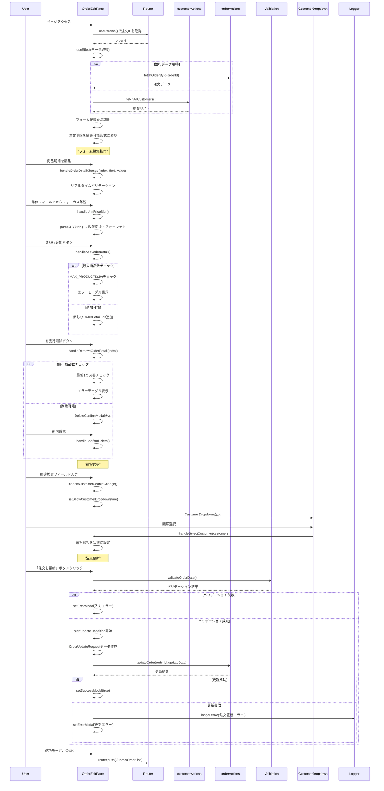

# 注文編集ページのシーケンス図



## 概要

注文編集ページ (`mbs/app/Home/OrderList/[id]/Edit/page.tsx`) は、既存注文のすべての情報を編集可能な高機能フォームコンポーネントです。

## 主要機能

### 1. 包括的な注文編集
- **注文基本情報**: 注文日、顧客、ステータス、備考
- **注文明細**: 商品名、数量、単価、摘要の完全編集
- **動的行操作**: 最大20行まで追加・削除可能

### 2. 高度な顧客選択システム
- **リアルタイム検索**: 顧客名・担当者名での絞り込み
- **ドロップダウンUI**: クリック外し検知による自動クローズ
- **選択状態管理**: 検索文字列変更時の選択クリア

### 3. インテリジェントな入力制御
- **通貨フォーマット**: 入力中は生文字列、フォーカス離脱時に数値変換
- **バリデーション**: リアルタイム検証とエラー表示
- **データ型変換**: parseJPYStringによる柔軟な金額入力

### 4. 納品状況の保持
- **既存データ保護**: 編集中も納品ステータスを表示
- **getDeliveryInfo**: IDベースの納品状況シミュレーション

### 5. 高度なUX設計
- **レスポンシブ**: モバイル・デスクトップ完全対応
- **プログレッシブ強化**: バリデーション結果に応じたボタン状態
- **エラーフィードバック**: 詳細なエラーメッセージとガイダンス

## 技術的特徴

### 1. 状態管理の最適化
- **useCallback**: イベントハンドラーの最適化
- **useMemo**: バリデーション結果・合計金額の計算最適化
- **useTransition**: 更新処理の非同期状態管理

### 2. 型安全な編集システム
```typescript
interface OrderDetailEdit {
  id: string;
  productName: string;
  unitPrice: number | string; // 入力中は文字列、表示時は数値
  quantity: number | '';
  description: string;
  deliveryStatus?: string;
}
```

### 3. バリデーション統合
```typescript
const validateOrderData = (orderDetails: OrderDetailEdit[], orderDate: string, customerId: string): ValidationResult
```

### 4. 差分更新システム
- 変更検知によるAPI最適化
- 元データとの比較表示

## 使用技術

- **Next.js**: App Router、Client Component
- **React Hooks**: useState、useEffect、useTransition、useCallback、useMemo
- **Server Actions**: fetchOrderById、fetchAllCustomers、updateOrder
- **カスタムフック**: なし（直接実装）
- **ログ**: @/lib/logger
- **UI**: TailwindCSS、レスポンシブグリッドシステム

## エラーハンドリング

1. **バリデーションエラー**: リアルタイム検証と詳細メッセージ
2. **API エラー**: 更新失敗時の適切なフィードバック
3. **データ不整合**: 存在しない注文IDへの対応

## 定数・制約

- **MAX_PRODUCTS**: 20（最大商品数）
- **最小商品数**: 1（削除制限）
- **必須項目**: 商品名または摘要（いずれか必須）

## ファイルパス
`mbs/app/Home/OrderList/[id]/Edit/page.tsx`