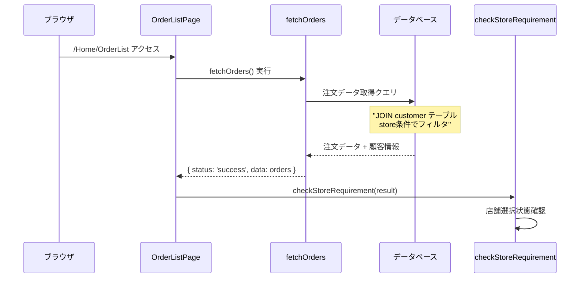
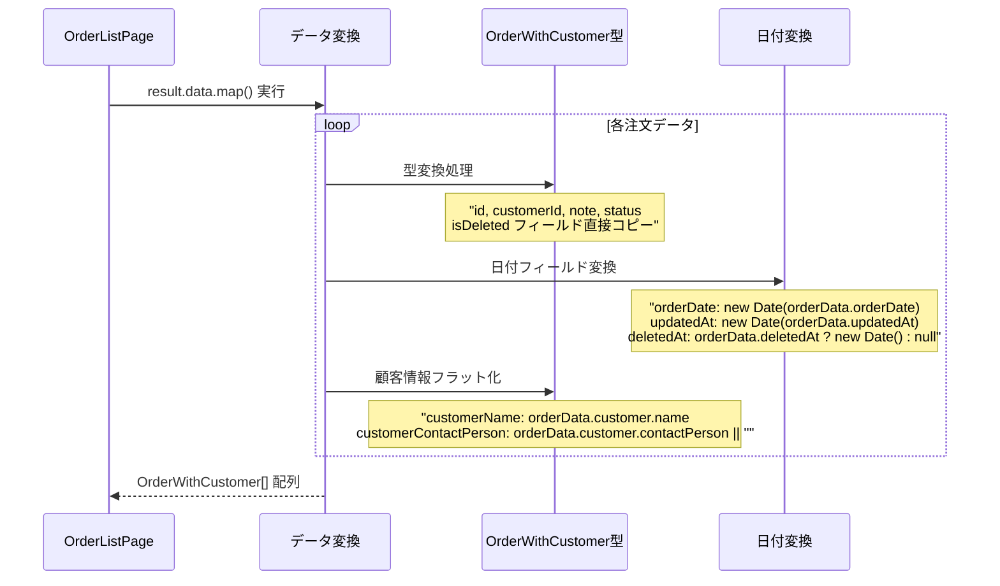
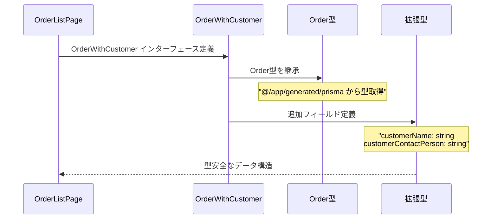
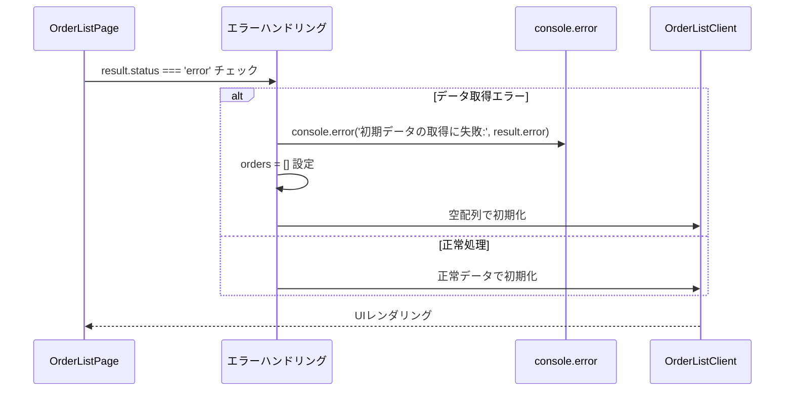
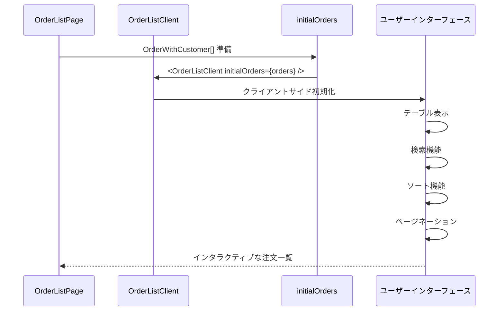
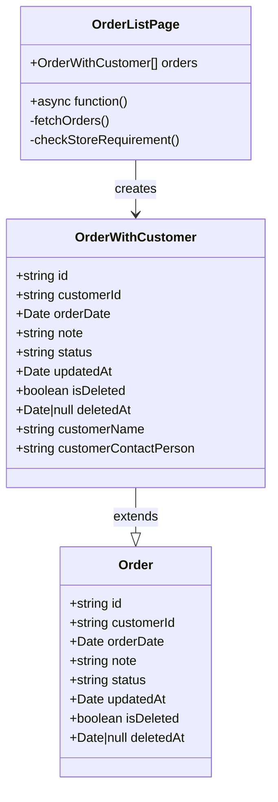
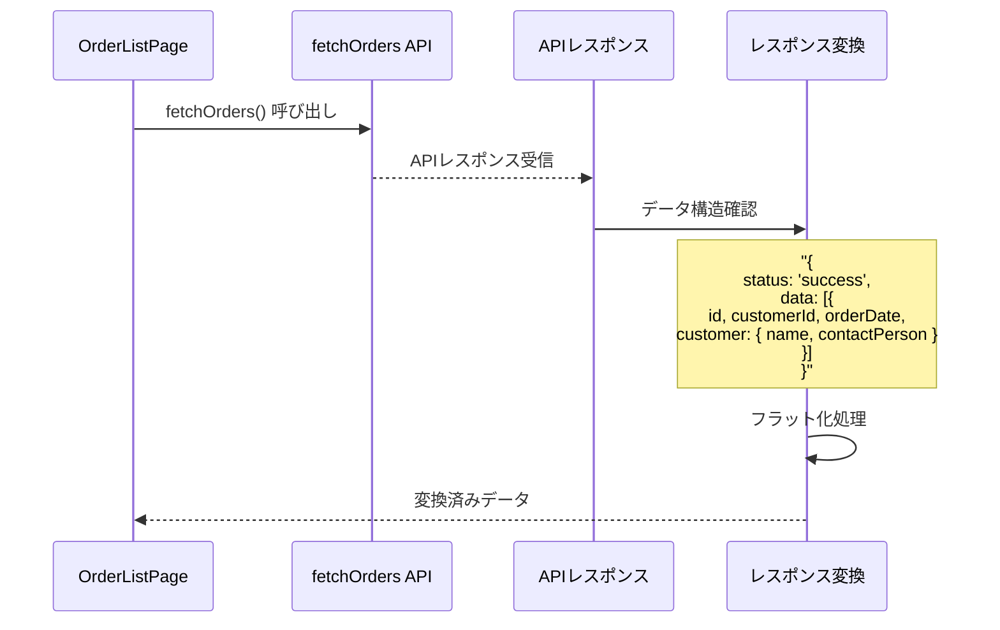
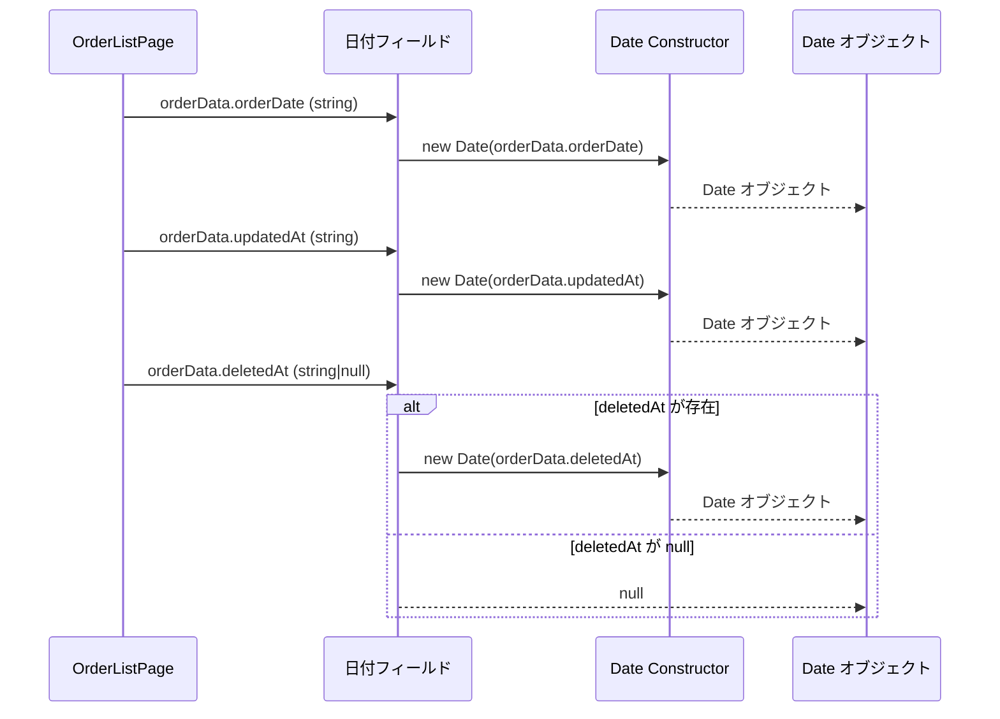

# OrderList Page - シーケンス図

## 概要
注文一覧ページの処理フローを示すシーケンス図です。

## 1. ページ初期化とデータ取得



## 2. 店舗要件チェック処理

```mermaid
sequenceDiagram
    participant Page as OrderListPage
    participant StoreCheck as checkStoreRequirement
    parameter Navigation as redirect
    participant Result as API結果

    Page->>StoreCheck: checkStoreRequirement(result) 実行
    StoreCheck->>Result: result.status 確認
    
    alt store_required
        Result-->>StoreCheck: 店舗選択が必要
        StoreCheck->>Navigation: redirect('/stores')
        Navigation-->>Browser: 店舗選択ページへ遷移
    else success
        Result-->>StoreCheck: 正常データ
        StoreCheck-->>Page: 処理続行
    else error
        Result-->>StoreCheck: エラーデータ
        StoreCheck-->>Page: エラーハンドリングへ
    end
```

## 3. データ変換処理



## 4. 型安全性とインターフェース



## 5. エラーハンドリング



## 6. クライアントコンポーネント連携



## データフロー構造



## API レスポンス処理



## 日付処理パターン



## サーバーサイドレンダリング最適化

```mermaid
flowchart TD
    A[HTTP Request] --> B[OrderListPage実行]
    B --> C[fetchOrders()]
    C --> D[データベースクエリ]
    D --> E{データ取得成功?}
    
    E -->|成功| F[データ変換処理]
    E -->|失敗| G[エラーログ出力]
    
    F --> H[OrderListClient作成]
    G --> I[空配列でClient作成]
    
    H --> J[SSRで完成HTML]
    I --> J
    
    J --> K[ブラウザに送信]
    
    style A fill:#e1f5fe
    style F fill:#c8e6c9
    style G fill:#ffcdd2
    style J fill:#c8e6c9
```

## 特徴

### 1. サーバーサイドレンダリング
- 初期データのサーバーサイド取得
- SEO対応と高速初期表示

### 2. 型安全性
- TypeScript型定義の活用
- Prisma生成型との連携

### 3. データ変換最適化
- API レスポンスの適切な変換
- フラット化による使いやすいデータ構造

### 4. エラーハンドリング
- 段階的なエラー処理
- ユーザーフレンドリーな表示

### 5. 店舗ベースアクセス制御
- 店舗選択状態の確認
- 適切なリダイレクト処理

## パフォーマンス考慮

### データベース最適化
- JOIN を使った効率的なクエリ
- 必要なフィールドのみ取得

### メモリ効率
- ストリーミング可能なデータ処理
- 大量データへの対応

### レンダリング最適化
- サーバーサイドでの事前処理
- クライアント初期化時間短縮

## 依存関係

### 外部依存
- `@/app/actions/orderActions` - データ取得
- `@/app/generated/prisma` - 型定義
- `@/app/utils/storeRedirect` - リダイレクト処理

### 内部依存
- `./components/OrderListClient` - UI コンポーネント
- データベース接続
- 店舗状態管理

## 拡張可能性

### フィルタリング機能
```typescript
interface OrderFilter {
  status?: string;
  dateRange?: { start: Date; end: Date };
  customerId?: string;
}
```

### ソート機能
```typescript
interface OrderSort {
  field: keyof OrderWithCustomer;
  direction: 'asc' | 'desc';
}
```

### ページネーション
```typescript
interface OrderPagination {
  page: number;
  limit: number;
  total: number;
}
```