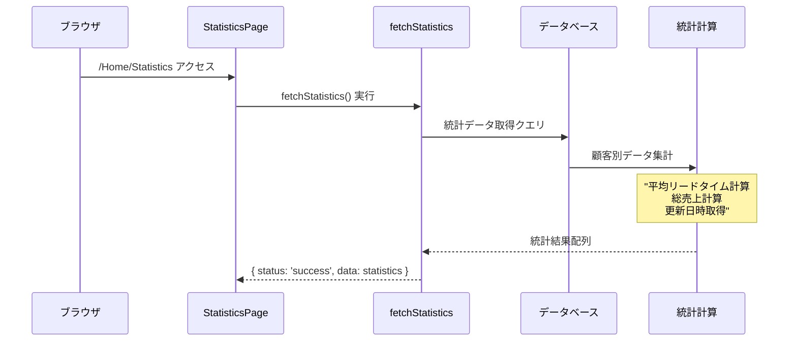
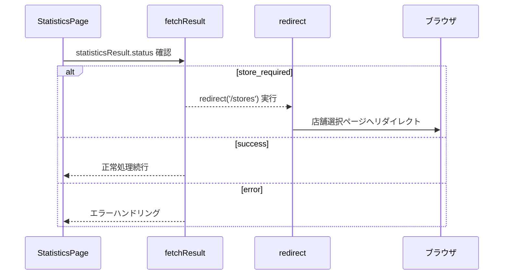
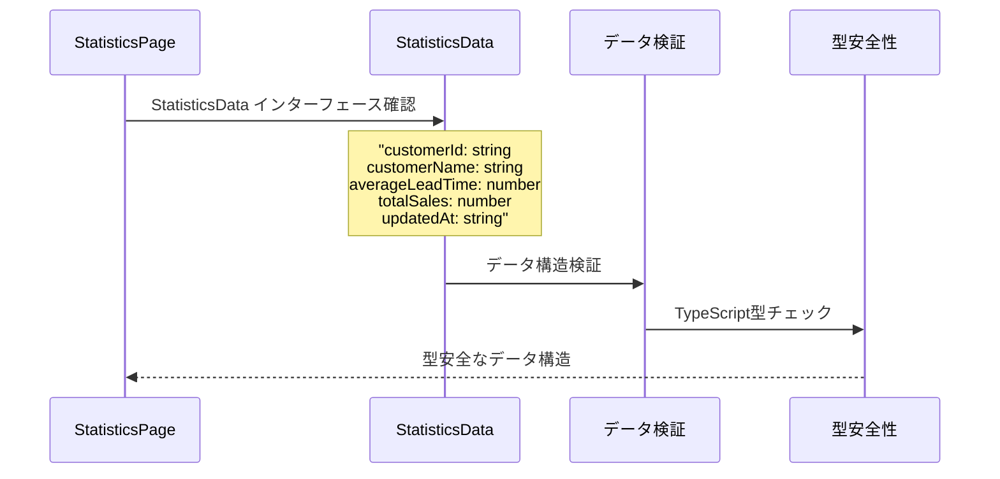
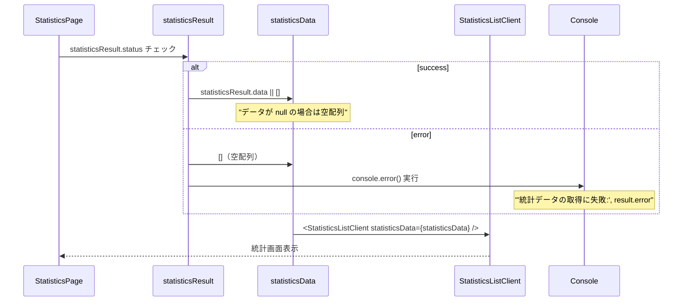
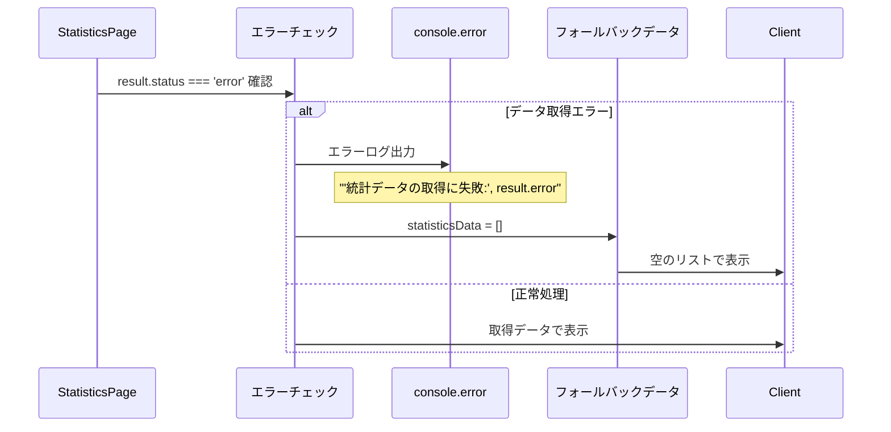
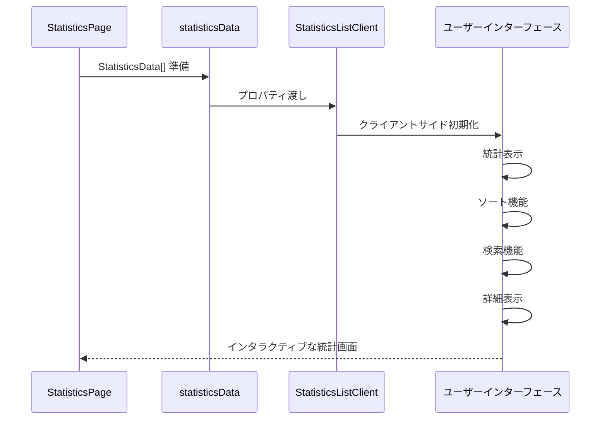
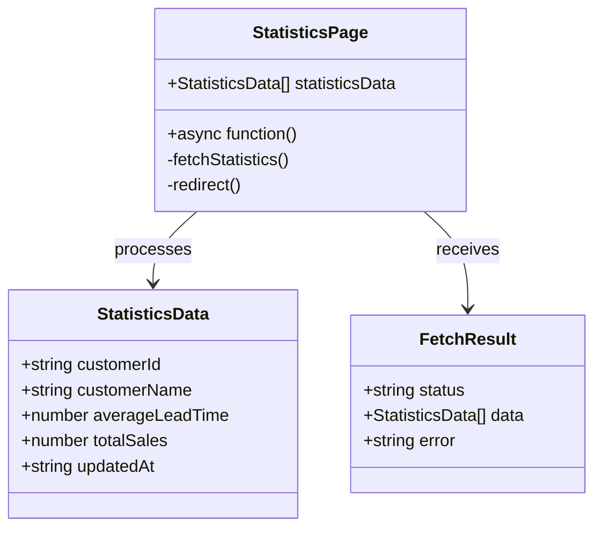
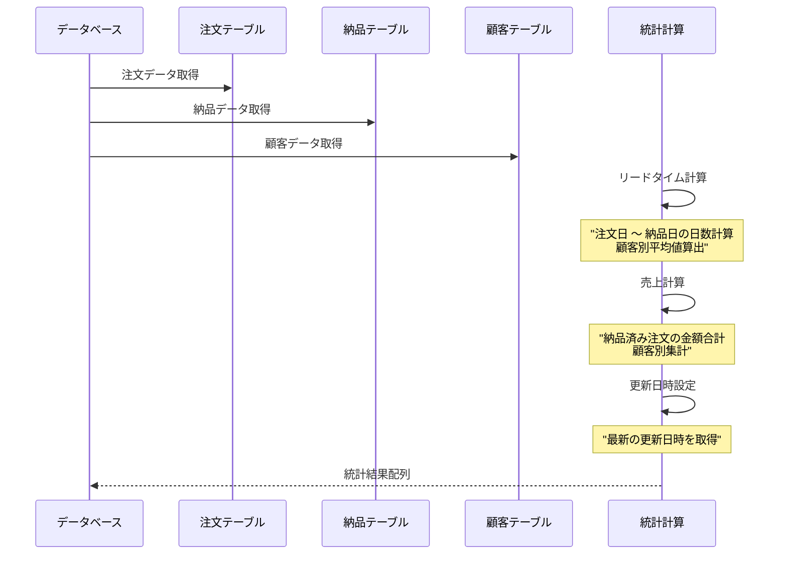
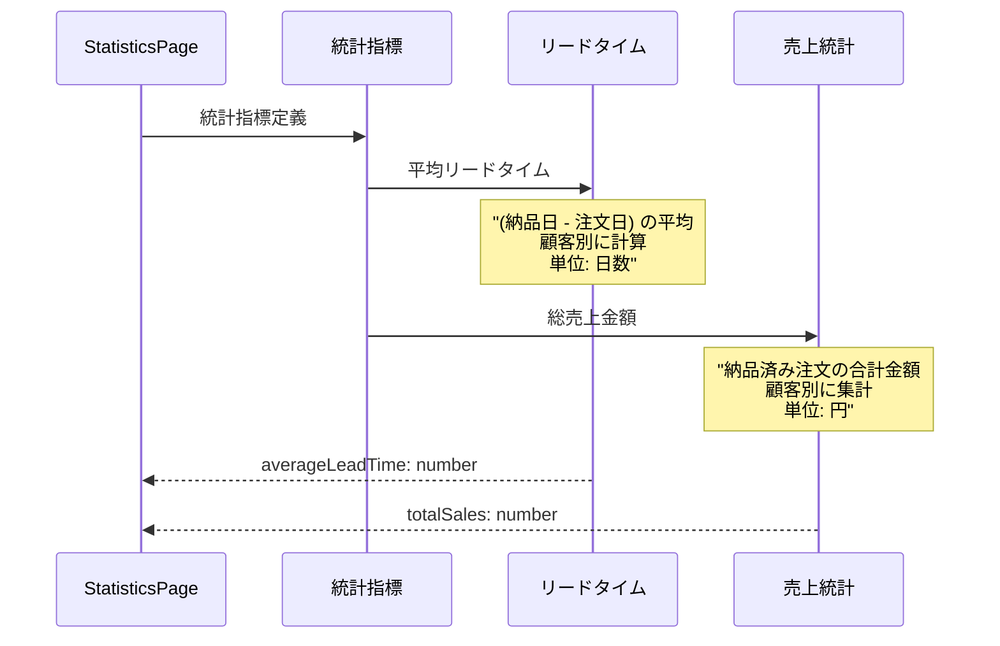

# Statistics Page - シーケンス図

## 概要
統計情報ページの処理フローを示すシーケンス図です。

## 1. ページ初期化とデータ取得



## 2. 店舗選択チェック処理



## 3. データ型定義と変換



## 4. 統計データ処理



## 5. エラーハンドリング



## 6. クライアントコンポーネント統合



## データフロー構造



## 統計データ計算フロー



## サーバーサイドレンダリング

```mermaid
flowchart TD
    A[HTTP Request] --> B[StatisticsPage実行]
    B --> C[fetchStatistics()]
    C --> D[統計データ計算]
    D --> E{データ取得成功?}
    
    E -->|成功| F[データ配列設定]
    E -->|店舗要求| G[/stores リダイレクト]
    E -->|エラー| H[エラーログ + 空配列]
    
    F --> I[StatisticsListClient作成]
    H --> I
    
    I --> J[SSRで完成HTML]
    J --> K[ブラウザに送信]
    
    style A fill:#e1f5fe
    style F fill:#c8e6c9
    style G fill:#ffecb3
    style H fill:#ffcdd2
    style J fill:#c8e6c9
```

## 統計メトリクス定義



## データ整合性チェック

```mermaid
sequenceDiagram
    participant Page as StatisticsPage
    parameter Validation as データ検証
    participant NullCheck as null チェック
    participant TypeCheck as 型チェック

    Page->>Validation: データ検証開始
    
    Validation->>NullCheck: statisticsResult.data || []
    Note over NullCheck: "データが null/undefined の場合<br/>空配列で初期化"
    
    Validation->>TypeCheck: TypeScript型チェック
    Note over TypeCheck: "StatisticsData インターフェース準拠<br/>各フィールドの型検証"
    
    NullCheck-->>Page: 安全なデータ配列
    TypeCheck-->>Page: 型安全性保証
```

## 特徴

### 1. サーバーサイド統計処理
- データベースレベルでの集計処理
- 効率的な統計計算

### 2. 店舗ベースフィルタリング
- 選択店舗に基づくデータ絞り込み
- アクセス制御との連携

### 3. 型安全な統計データ
- TypeScript インターフェースの活用
- 数値データの適切な型定義

### 4. リアルタイム統計
- 最新データに基づく統計
- 更新日時の追跡

### 5. エラー耐性
- データ取得失敗時の適切な処理
- ユーザー体験の維持

## パフォーマンス最適化

### データベース最適化
```sql
-- 効率的な統計クエリ
SELECT 
  customer_id,
  customer_name,
  AVG(lead_time) as average_lead_time,
  SUM(total_amount) as total_sales,
  MAX(updated_at) as updated_at
FROM statistics_view
WHERE store_id = ?
GROUP BY customer_id, customer_name
```

### メモリ効率
- ストリーミング可能なデータ処理
- 大量統計データへの対応

### キャッシング戦略
- 統計データのキャッシング
- 定期的な再計算とキャッシュ更新

## 依存関係

### 外部依存
- `next/navigation` - リダイレクト機能
- `@/app/actions/statisticsActions` - 統計データ取得

### 内部依存
- `./components/StatisticsListClient` - UI コンポーネント
- データベース接続
- 店舗状態管理

## 拡張可能性

### 追加統計指標
```typescript
interface ExtendedStatistics extends StatisticsData {
  orderCount: number;
  averageOrderValue: number;
  lastOrderDate: string;
  customerRank: number;
}
```

### 期間フィルタリング
```typescript
interface StatisticsFilter {
  startDate?: string;
  endDate?: string;
  customerId?: string;
}
```

### エクスポート機能
```typescript
interface ExportOptions {
  format: 'csv' | 'excel' | 'pdf';
  includeCharts: boolean;
  dateRange: DateRange;
}
```

## セキュリティ考慮

### データアクセス制御
- 店舗レベルでのデータ分離
- 権限に基づくアクセス制限

### 統計データ保護
- 機密性の高い売上データの適切な処理
- ログ出力時の個人情報除去