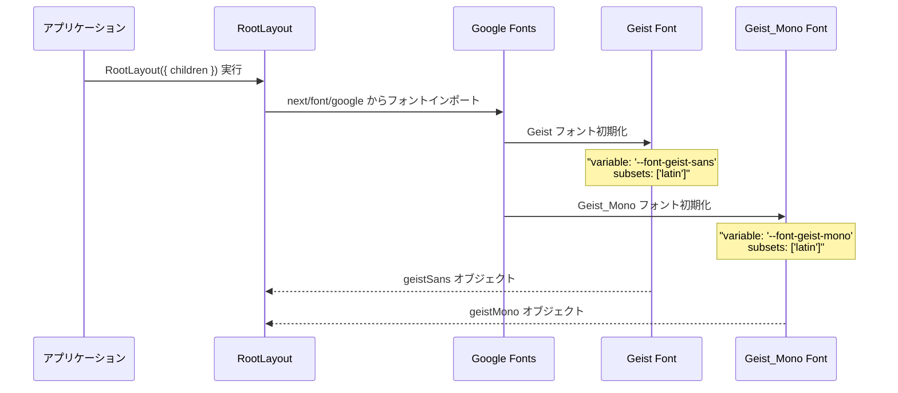
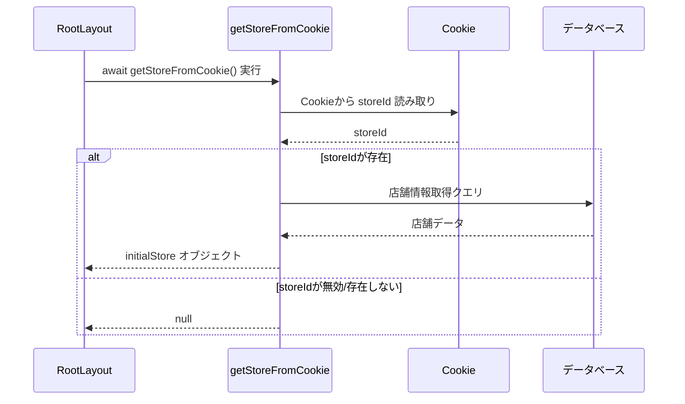
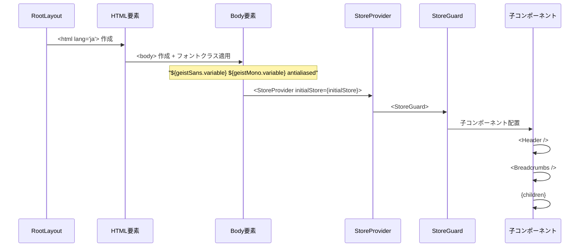
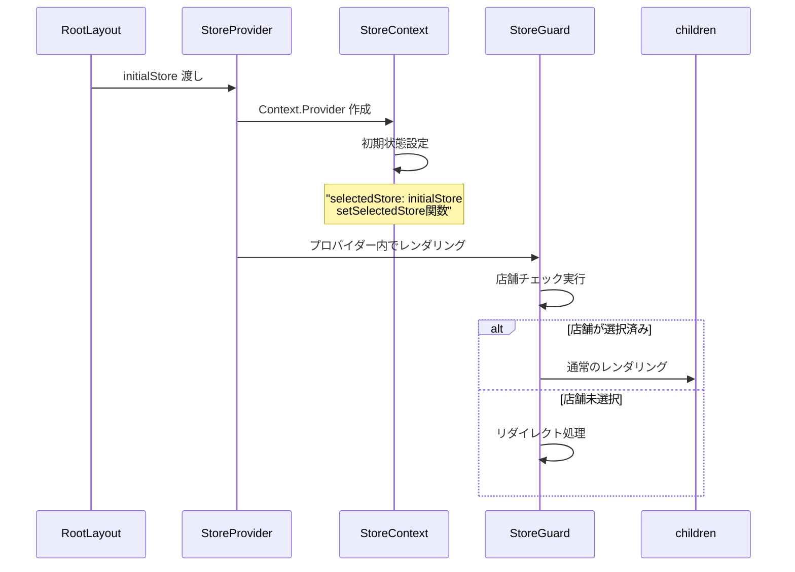
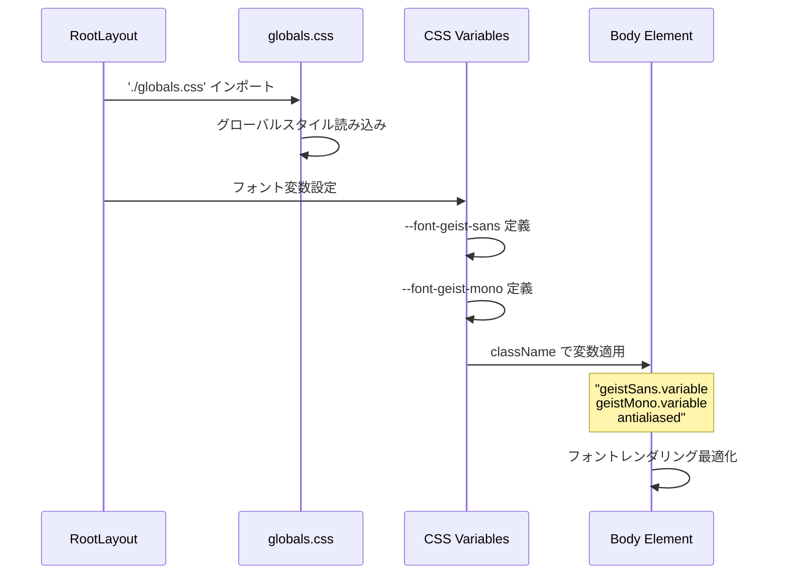
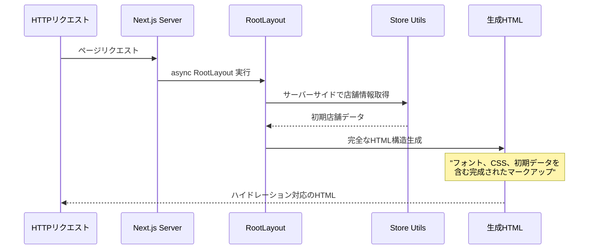
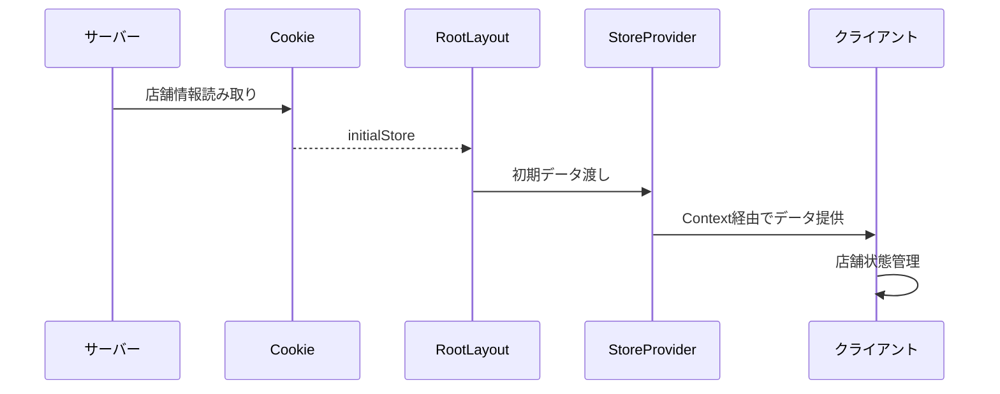
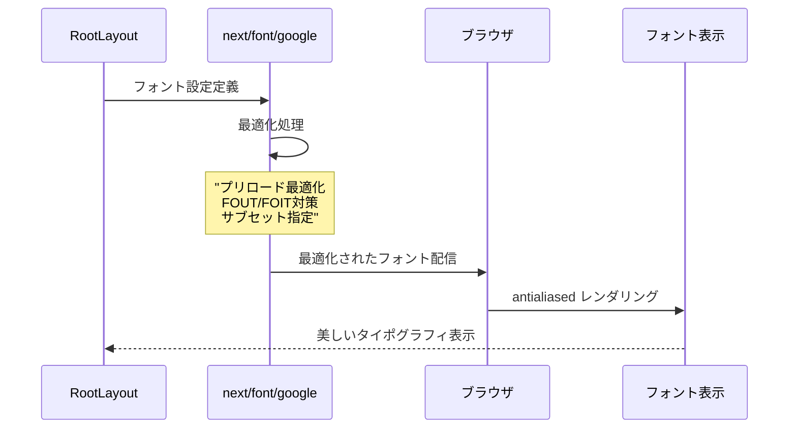

# Layout (Root Layout) - シーケンス図

## 概要
アプリケーションのルートレイアウトの処理フローを示すシーケンス図です。

## 1. レイアウト初期化とフォント設定

## 2. 店舗情報の取得

## 3. コンポーネント階層構築

## 4. プロバイダーチェーン

## 5. CSS とフォント適用

## 6. サーバーサイドレンダリング

## レイアウト構造

RootLayoutコンポーネントは以下の構造で構成されています：

### RootLayoutクラス
- **async function**: 非同期関数として定義され、サーバーサイドで店舗情報を取得
- **children**: ReactNodeとして子コンポーネントを受け取り
- **getStoreFromCookie()**: 内部メソッドでCookieから店舗情報を取得
- **Geist fonts**: Google Fontsからのフォント設定を管理

### FontConfig設定
- **Geist geistSans**: メインテキスト用のGeistフォント
- **Geist_Mono geistMono**: モノスペース用のGeist_Monoフォント
- **variable**: CSS変数名を定義
- **subsets**: 'latin'サブセットを指定

### LayoutHierarchy構造
- **html[lang="ja"]**: 日本語指定のHTML要素
- **body[className]**: フォントクラスが適用されたbody要素
- **StoreProvider**: 店舗状態管理プロバイダー
- **StoreGuard**: 店舗選択状態を監視するガード
- **Header**: アプリケーションヘッダー
- **Breadcrumbs**: パンくずナビゲーション
- **children**: 各ページのコンテンツ

RootLayoutはFontConfigを使用してフォント設定を行い、LayoutHierarchyの構造でコンポーネントをレンダリングします。

## コンポーネント配置図

コンポーネントの階層構造は以下の通りです：

### メイン階層
1. **html[lang="ja"]** - 日本語指定のルート要素
2. **body + font classes** - フォントクラスが適用されたbody要素
3. **StoreProvider** - 店舗状態管理の最上位プロバイダー
4. **StoreGuard** - アクセス制御を行うガードコンポーネント
5. **Header** - アプリケーションのヘッダー部分
6. **Breadcrumbs** - ナビゲーション用パンくずリスト
7. **children** - 各ページの動的コンテンツ

### 外部依存関係
- **initialStore** → StoreProviderに店舗の初期データを提供
- **geistSans** → bodyにメインフォントのCSS変数を設定
- **geistMono** → bodyにモノスペースフォントのCSS変数を設定
- **globals.css** → bodyにグローバルスタイルを適用

この構造により、フォント設定、状態管理、アクセス制御が統合された安定したレイアウトシステムが構築されています。

## データフロー

## フォント最適化

## 特徴

### 1. サーバーサイド初期化
- レイアウト時に店舗情報取得
- 初期レンダリングの最適化

### 2. フォント最適化
- Google Fontsの最適な読み込み
- antialiased による美しい表示

### 3. グローバル状態管理
- StoreProvider による状態提供
- アプリケーション全体での店舗情報共有

### 4. セキュリティガード
- StoreGuard による保護
- 未認証時の自動リダイレクト

### 5. 多言語対応基盤
- html lang="ja" による日本語設定
- 国際化対応の基礎構造

## 依存関係

### 外部依存
- `next/font/google` - フォント最適化
- `./globals.css` - グローバルスタイル

### 内部依存
- `./components/Header` - ヘッダーコンポーネント
- `./components/Breadcrumbs` - パンくずリスト
- `./components/StoreGuard` - アクセス保護
- `./contexts/StoreContext` - 状態管理
- `./utils/storeUtils` - 店舗ユーティリティ

### パフォーマンス最適化
- フォントのプリロード
- サーバーサイドでの初期データ取得
- CSS変数による効率的なスタイル適用