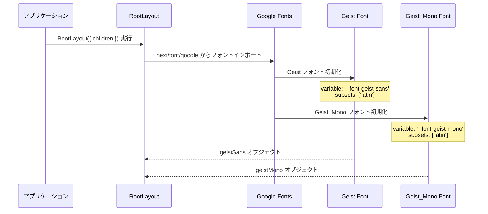
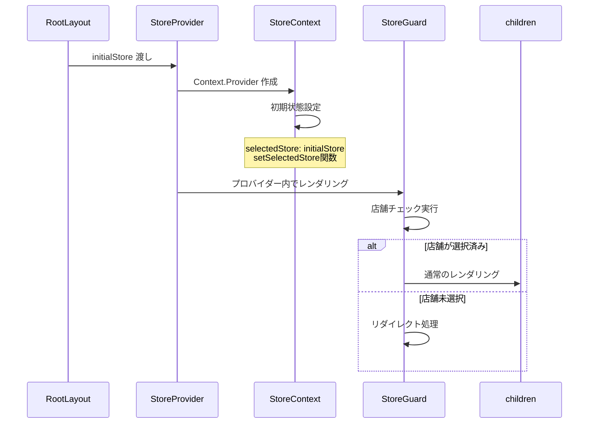
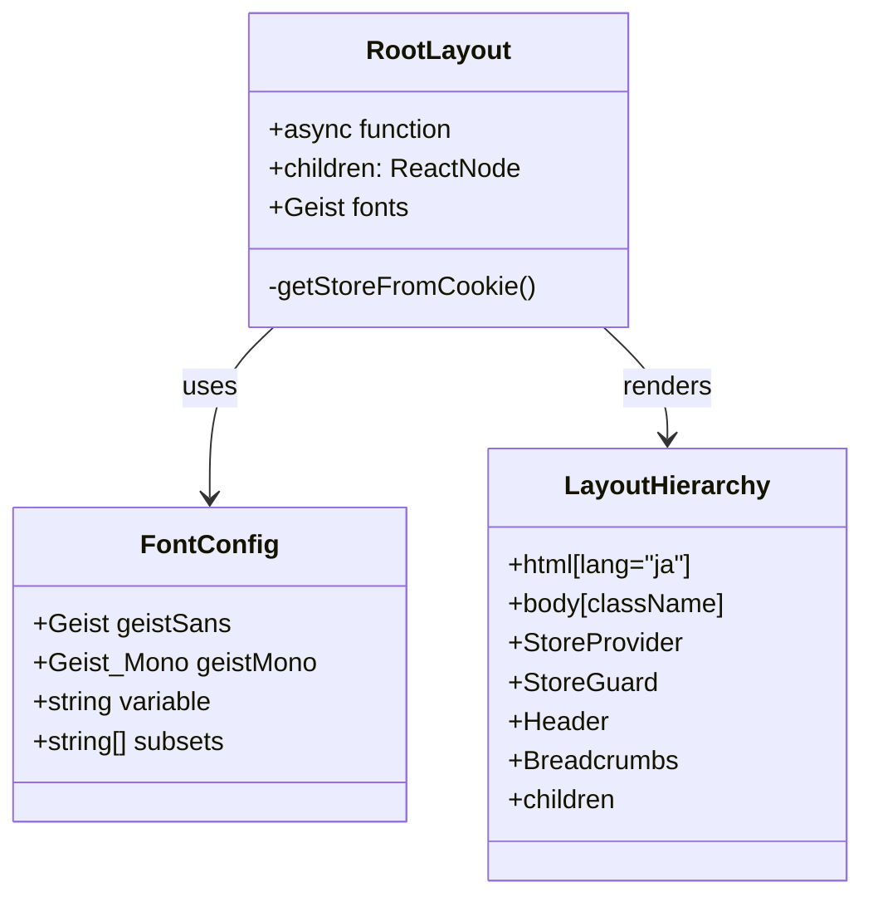

# Layout (Root Layout) - シーケンス図

## 概要
アプリケーションのルートレイアウトの処理フローを示すシーケンス図です。

## 1. レイアウト初期化とフォント設定



## 2. 店舗情報の取得


## 3. コンポーネント階層構築


## 4. プロバイダーチェーン



## 5. CSS とフォント適用


## 6. サーバーサイドレンダリング


## レイアウト構造



## コンポーネント配置図

```mermaid
flowchart TD
    A[html lang="ja"] --> B[body + font classes]
    B --> C[StoreProvider]
    C --> D[StoreGuard]
    D --> E[Header]
    D --> F[Breadcrumbs]
    D --> G[children - 各ページ]
    
    H[initialStore] --> C
    I[geistSans] --> B
    J[geistMono] --> B
    K[globals.css] --> B
    
    style A fill:#e1f5fe
    style C fill:#fff3e0
    style D fill:#fff3e0
    style E fill:#c8e6c9
    style F fill:#c8e6c9
    style G fill:#ffecb3
```

## データフロー


## フォント最適化


## 特徴

### 1. サーバーサイド初期化
- レイアウト時に店舗情報取得
- 初期レンダリングの最適化

### 2. フォント最適化
- Google Fontsの最適な読み込み
- antialiased による美しい表示

### 3. グローバル状態管理
- StoreProvider による状態提供
- アプリケーション全体での店舗情報共有

### 4. セキュリティガード
- StoreGuard による保護
- 未認証時の自動リダイレクト

### 5. 多言語対応基盤
- html lang="ja" による日本語設定
- 国際化対応の基礎構造

## 依存関係

### 外部依存
- `next/font/google` - フォント最適化
- `./globals.css` - グローバルスタイル

### 内部依存
- `./components/Header` - ヘッダーコンポーネント
- `./components/Breadcrumbs` - パンくずリスト
- `./components/StoreGuard` - アクセス保護
- `./contexts/StoreContext` - 状態管理
- `./utils/storeUtils` - 店舗ユーティリティ

### パフォーマンス最適化
- フォントのプリロード
- サーバーサイドでの初期データ取得
- CSS変数による効率的なスタイル適用