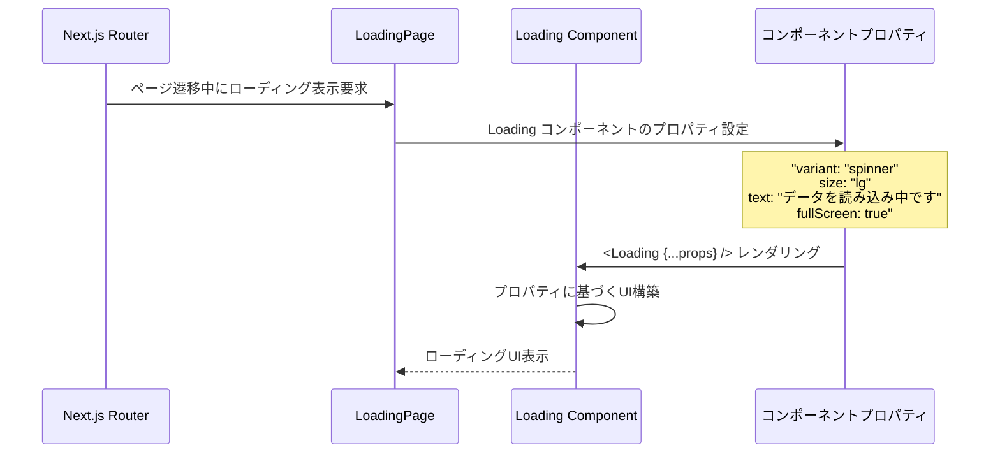
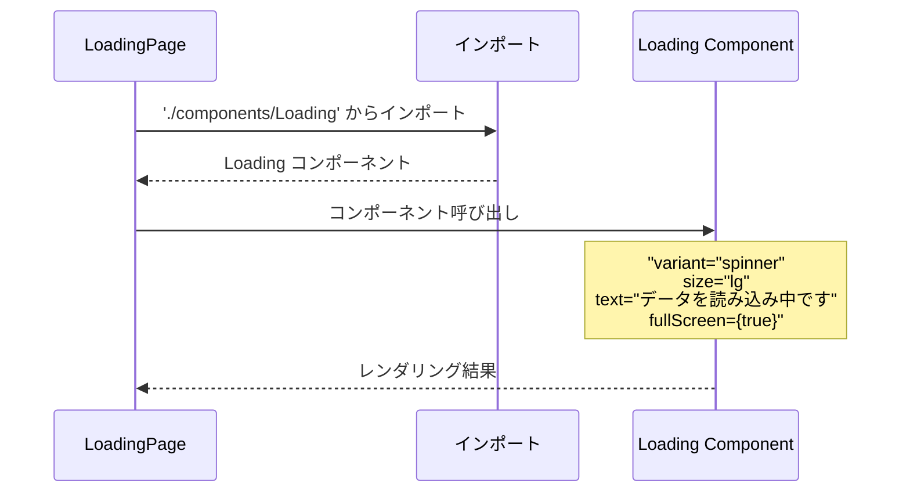
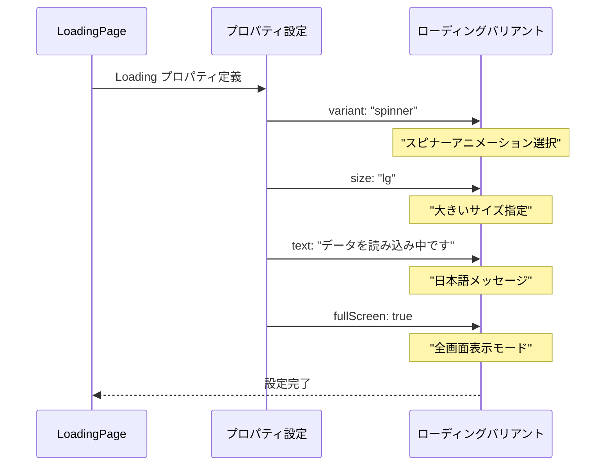
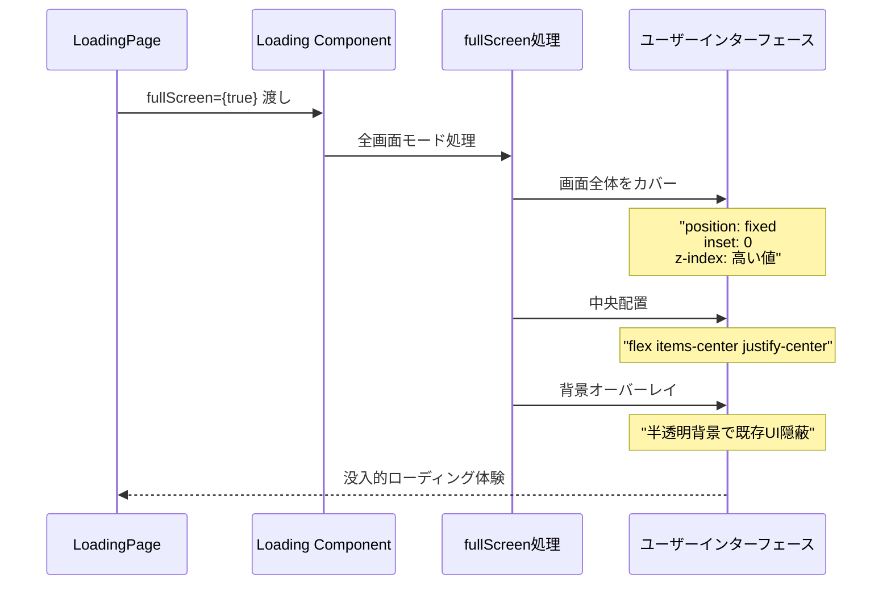
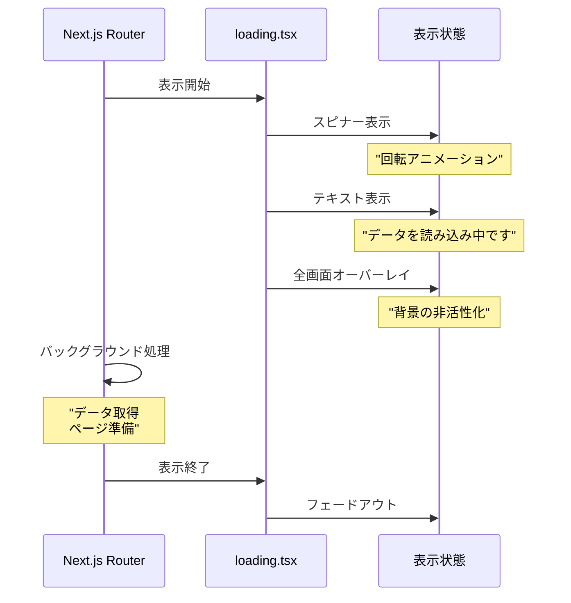
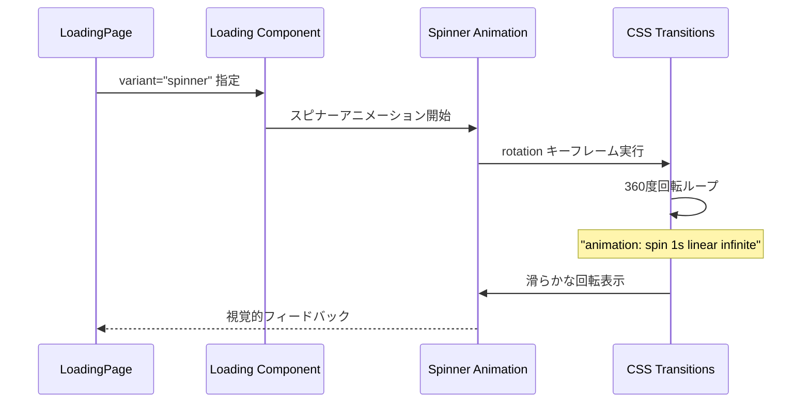

# Loading Page - シーケンス図

## 概要
グローバルローディングページの処理フローを示すシーケンス図です。

## 1. ローディングページ初期化



## 2. Loading コンポーネント呼び出し



## 3. プロパティ設定処理



## 4. Next.js ローディング統合

```mermaid
sequenceDiagram
    participant User as ユーザー
    participant NextRouter as Next.js Router
    participant LoadingPage as loading.tsx
    parameter TargetPage as 目的ページ

    User->>NextRouter: ページ遷移開始
    NextRouter->>LoadingPage: 自動ローディング表示
    LoadingPage->>LoadingPage: Loading コンポーネント表示
    
    NextRouter->>NextRouter: ページデータ取得処理
    Note over NextRouter: "サーバーコンポーネント実行<br/>データフェッチ<br/>レンダリング準備"
    
    NextRouter->>TargetPage: ページ準備完了
    TargetPage-->>User: 新しいページ表示
    Note over LoadingPage: "ローディング画面終了"
```

## 5. フルスクリーンローディング表示



## 6. ローディング状態管理

**ローディング状態の流れ**
1. ページ遷移開始 → loading.tsx 表示
2. Loading Component レンダリング
   - Spinner Animation: 回転アニメーション表示
   - Loading Text: 「データを読み込み中です」表示
   - Full Screen Overlay: 全画面オーバーレイ表示
3. データ取得完了待機
4. 新しいページ準備完了 → Loading 画面終了 → 目的ページ表示

このプロセスにより、ユーザーに明確な読み込み状態を提供します。

## コンポーネント構造

**LoadingPage コンポーネント構造**
- LoadingPage: function LoadingPage() と JSX を返却
- LoadingComponent: variant「spinner」、size「lg」、text、fullScreen プロパティを持つ
- LoadingProps: variant、size、text、fullScreen の文字列およびブール型

LoadingPage は LoadingComponent をレンダリングし、LoadingComponent は LoadingProps を受け取ります。

## 表示パターン



## アニメーション処理



## 特徴

### 1. Next.js 統合
- App Router の loading.tsx ファイル
- 自動的なローディング状態管理

### 2. ユーザー体験最適化
- 明確な読み込み状態表示
- 日本語でのわかりやすいメッセージ

### 3. 全画面対応
- fullScreen プロパティによる没入体験
- 既存UIの非活性化

### 4. 再利用可能なコンポーネント
- Loading コンポーネントの活用
- 設定可能なプロパティ

### 5. アニメーション最適化
- スムーズなスピナーアニメーション
- パフォーマンス重視の実装

## 使用シナリオ

### 1. ページ遷移時
- 重いページコンポーネントの読み込み
- サーバーサイドデータ取得待機

### 2. データフェッチ中
- API呼び出し処理中
- データベースクエリ実行中

### 3. レンダリング処理中
- 複雑なコンポーネントの初期化
- 大量データの処理

## パフォーマンス考慮

### 軽量実装
- 最小限のコンポーネント構造
- 効率的なプロパティ渡し

### アニメーション最適化
- CSS transform の活用
- GPU アクセラレーション対応

### メモリ効率
- 不要な状態管理の回避
- シンプルなライフサイクル