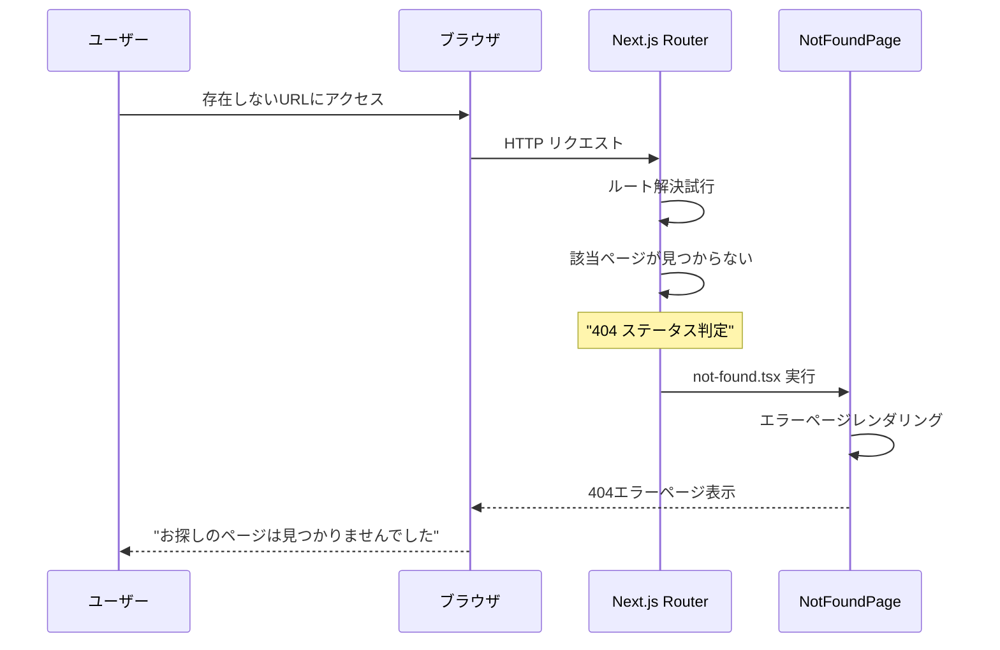
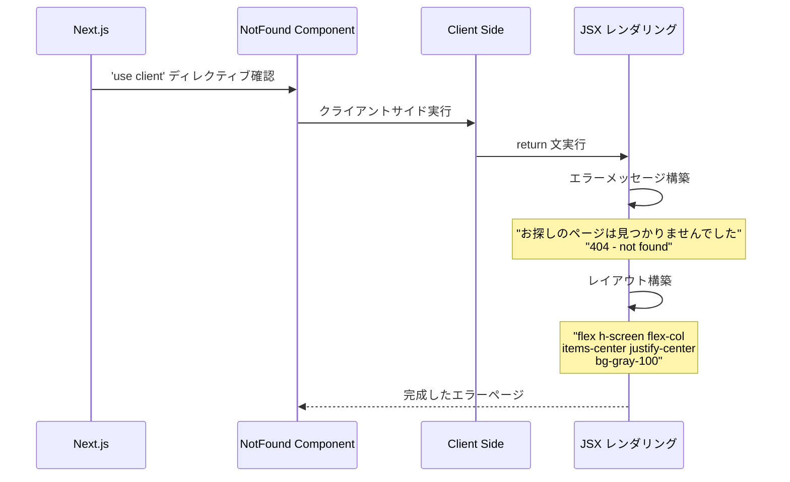
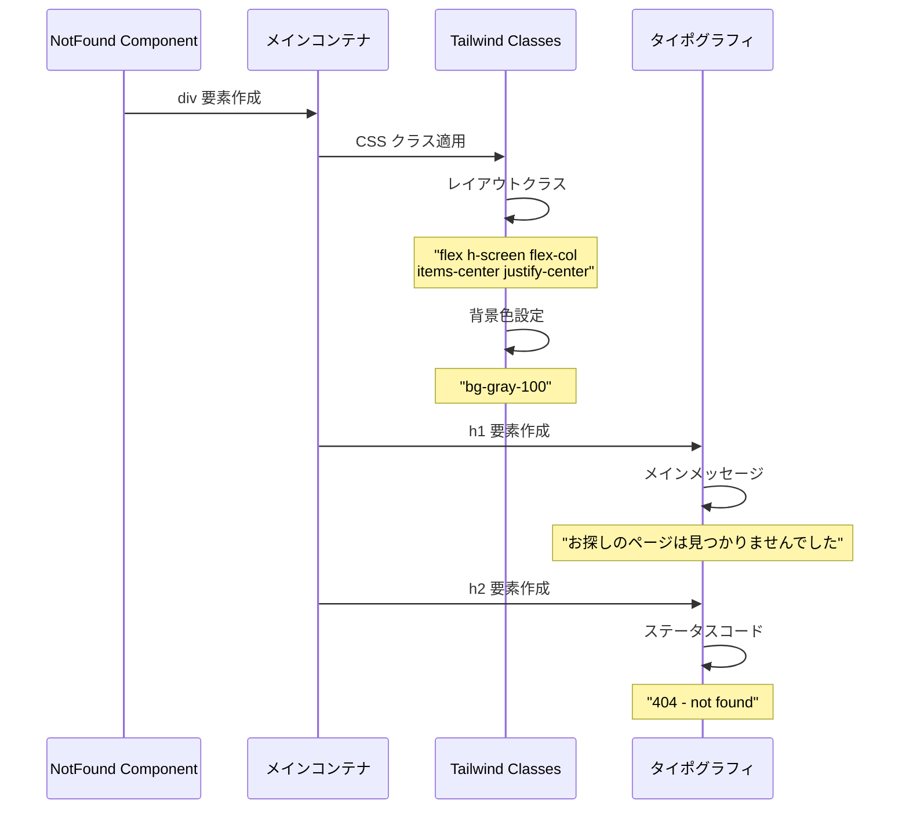
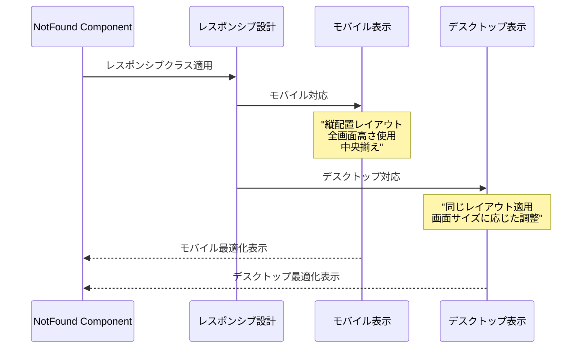
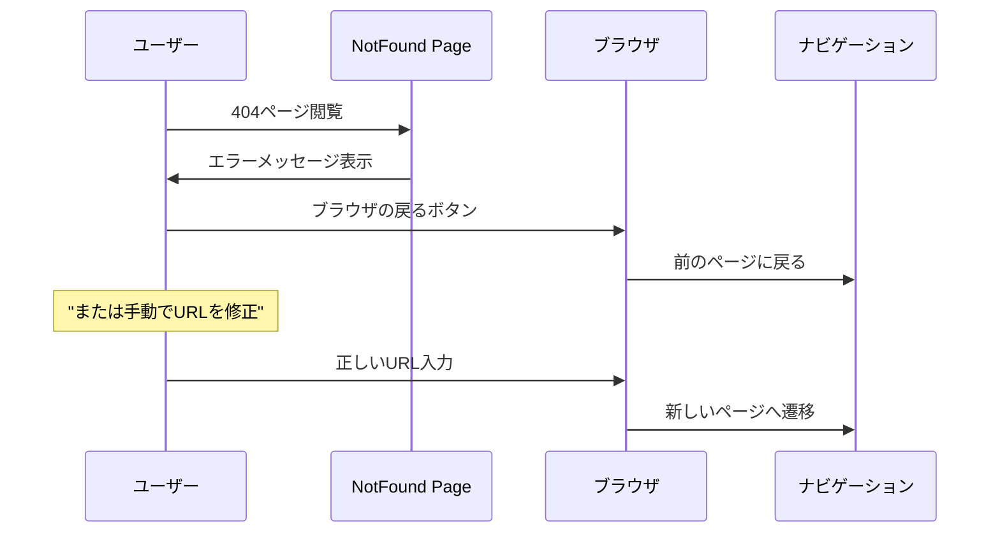
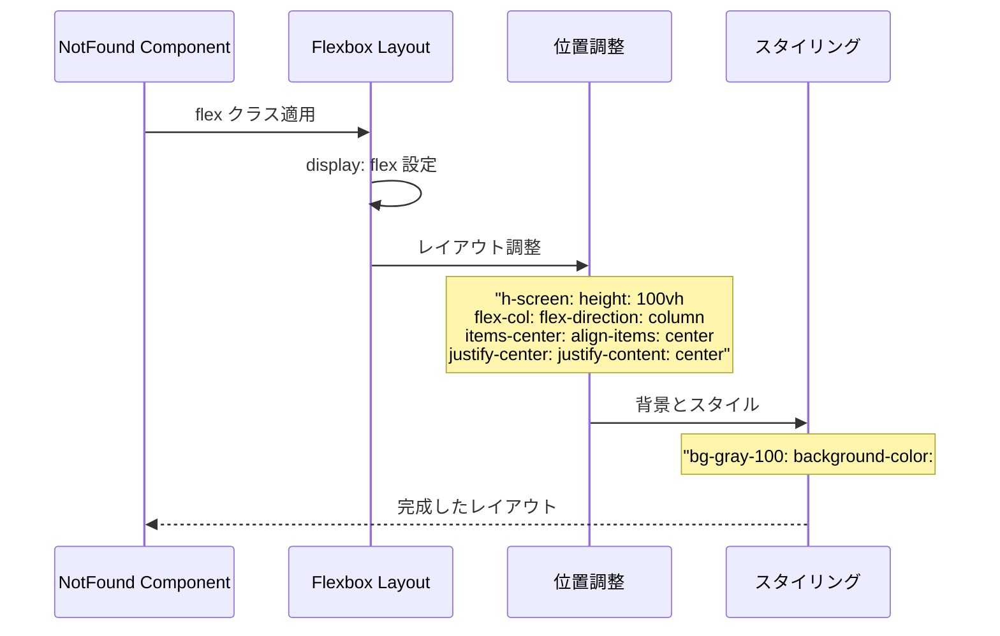
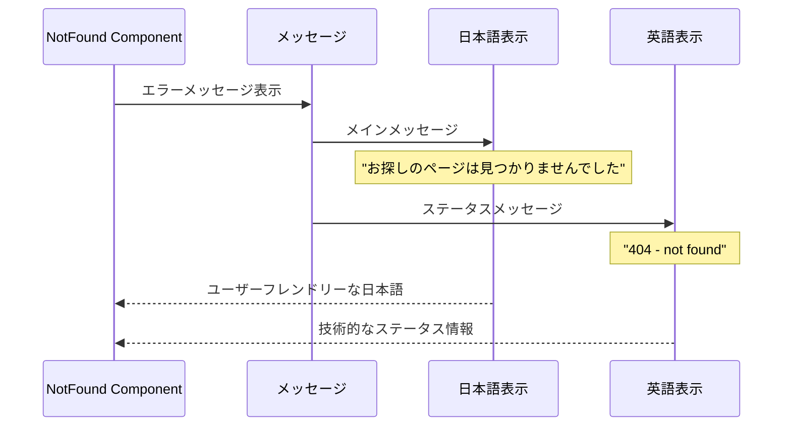

# Not Found Page - シーケンス図

## 概要
404エラーページの処理フローを示すシーケンス図です。

## 1. 404エラー発生とページ表示



## 2. クライアントサイドコンポーネント初期化



## 3. レイアウトとスタイリング



## 4. エラーハンドリングフロー

404エラーハンドリングの流れ：

1. **URLアクセス** → Next.js Router
2. **ページ存在確認**
   - 存在する → 通常ページ表示
   - 存在しない → 404判定
3. **not-found.tsx実行** → クライアントサイド処理
4. **エラーページ表示** → ユーザーへのフィードバック

## 5. レスポンシブ表示処理



## 6. ユーザーインタラクション処理



## コンポーネント構造

### NotFound
- `"use client"` - クライアントコンポーネント
- `function NotFound()` - メイン関数
- JSXを返却

### ErrorLayout
- `div container` - コンテナ要素
- `h1 mainMessage` - メインメッセージ
- `h2 statusCode` - ステータスコード

### Styling（Tailwind CSS）
- `flex layout` - フレックスレイアウト
- `h-screen height` - 画面フル高さ
- `flex-col direction` - 縦方向配置
- `items-center` - 中央揃え
- `justify-center` - 縦中央揃え
- `bg-gray-100` - 背景色

## CSS クラス構造



## 多言語対応



## 特徴

### 1. クライアントサイドコンポーネント
- "use client" による最適化
- ブラウザでの高速レンダリング

### 2. ユーザーフレンドリー
- 分かりやすい日本語メッセージ
- 技術的情報も併記

### 3. レスポンシブデザイン
- 全デバイス対応
- 画面サイズに応じた最適表示

### 4. 中央配置レイアウト
- 視覚的に分かりやすい配置
- プロフェッショナルな外観

### 5. 軽量実装
- 最小限の依存関係
- 高速な読み込み

## ユーザー体験最適化

### 視覚的明確性
- コントラストの高い表示
- 読みやすいタイポグラフィ

### エラー理解促進
- 明確なエラー説明
- 次のアクション示唆

### アクセシビリティ
- セマンティックHTML構造
- スクリーンリーダー対応

## パフォーマンス考慮

### 最小リソース使用
- 軽量なコンポーネント
- 外部依存の回避

### 高速表示
- シンプルなDOM構造
- 効率的なCSS適用

### メモリ効率
- 状態管理なし
- 静的コンテンツ

## 拡張可能性

### カスタマイズポイント
```typescript
// メッセージのカスタマイズ
const customMessage = "ページが見つかりません";

// スタイルの調整
const customStyles = "bg-blue-50 text-blue-900";

// 追加機能
const addHomeLink = true;
```

### 国際化対応
```typescript
// 多言語メッセージ
const messages = {
  ja: "お探しのページは見つかりませんでした",
  en: "Page not found"
};
```