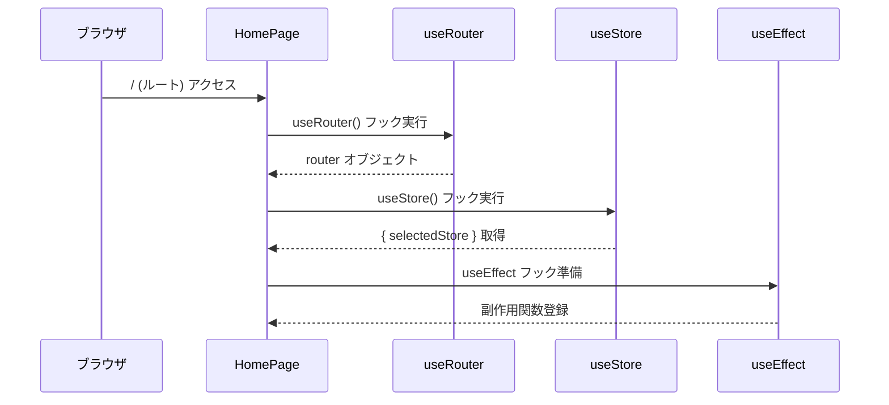
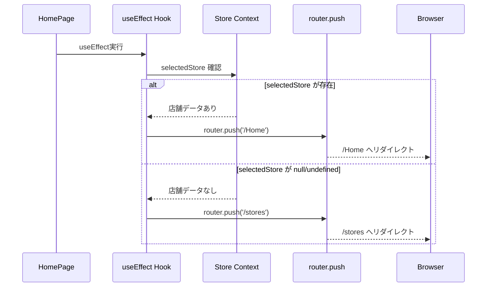
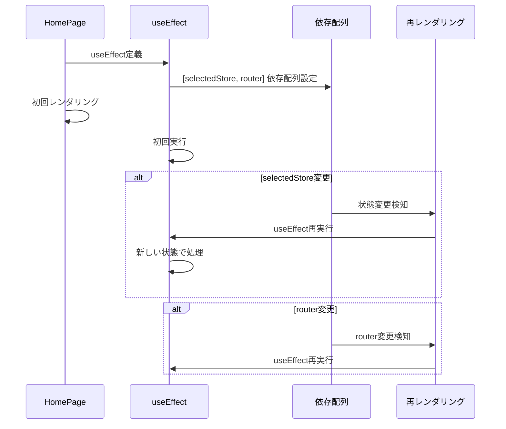
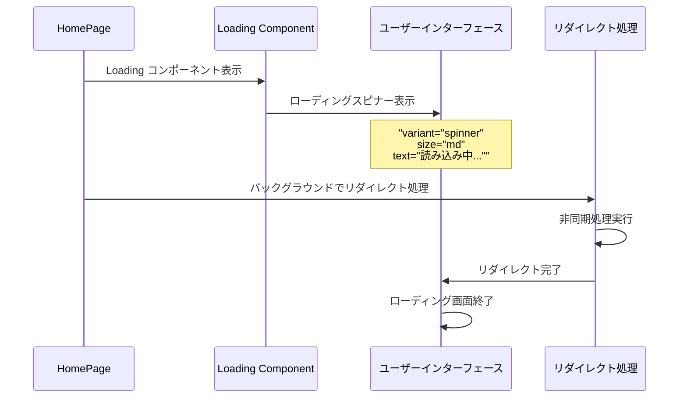
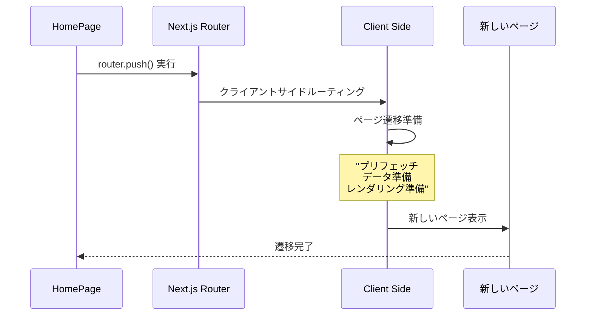
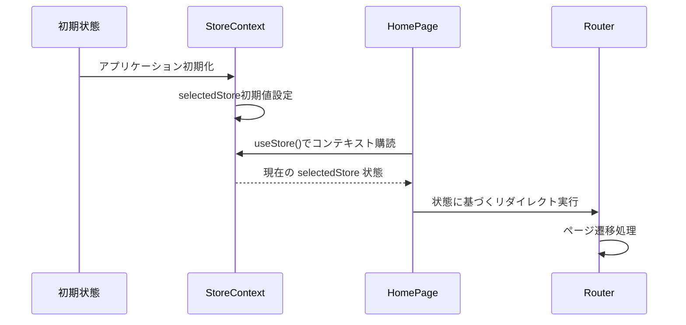
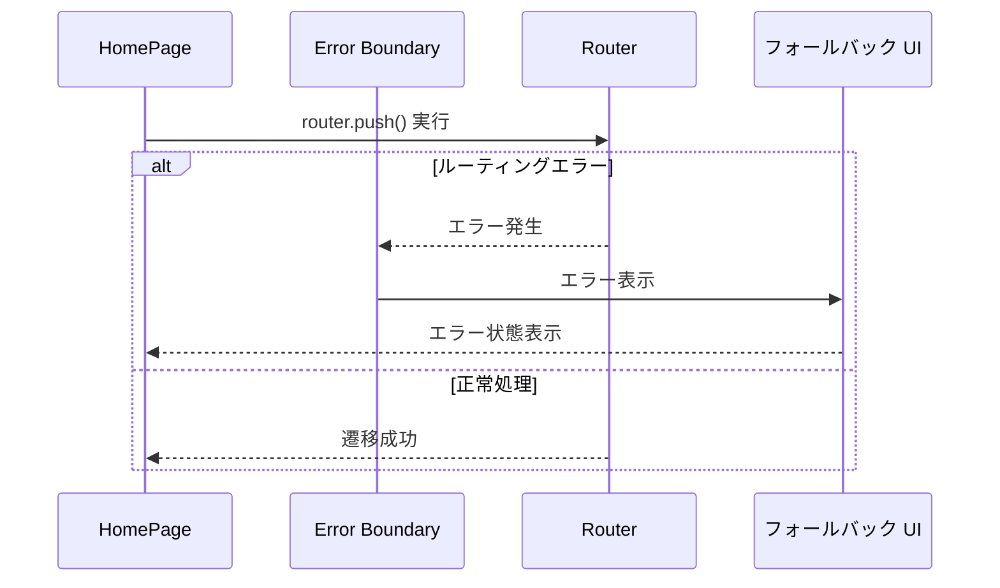
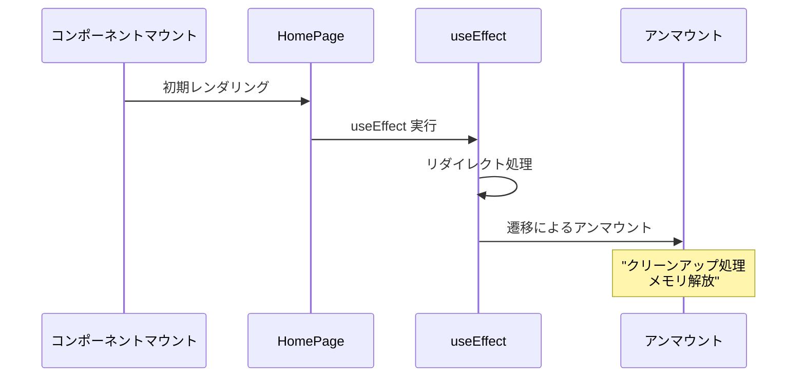

# Root Page - シーケンス図

## 概要
ルートページ（リダイレクト処理）の処理フローを示すシーケンス図です。

## 1. ページ初期化と依存関係読み込み



## 2. 店舗選択状態チェック



## 3. リダイレクト処理フロー

**リダイレクト処理の流れ**
1. ルートアクセス (/) → HomePage コンポーネント
2. useStore() で店舗状態取得
3. selectedStore 存在確認
   - 存在する場合: router.push('/Home') → ホームページ表示
   - 存在しない場合: router.push('/stores') → 店舗選択ページ表示

この処理により、ユーザーは店舗選択状態に応じて適切なページに自動的にリダイレクトされます。

## 4. useEffect依存関係管理



## 5. ローディング表示処理



## 6. クライアントサイドナビゲーション



## Context統合パターン

**コンポーネント関係構造**
- HomePage: "use client"、useRouter()、useStore()、useEffect() を使用
- StoreContext: selectedStore と setSelectedStore() を提供
- NextRouter: push()、replace()、back() メソッドを提供
- LoadingComponent: variant「spinner」、size「md」、text プロパティを持つ

HomePage は StoreContext を使用し、NextRouter を利用して LoadingComponent をレンダリングします。

## 状態管理フロー



## エラーハンドリング



## レンダリングライフサイクル



## 特徴

### 1. 自動リダイレクト
- 店舗選択状態による自動分岐
- ユーザーアクション不要

### 2. クライアントサイドルーティング
- SPA的な高速遷移
- サーバーラウンドトリップ不要

### 3. 状態管理統合
- Context APIとの連携
- リアクティブな状態反映

### 4. ローディング体験
- 遷移中の視覚的フィードバック
- ユーザー待機時間の軽減

### 5. 依存関係最適化
- useEffect依存配列の適切な管理
- 不要な再実行の防止

## パフォーマンス最適化

### React Hook最適化
```typescript
// 適切な依存配列
useEffect(() => {
  // リダイレクト処理
}, [selectedStore, router]);

// メモ化による最適化
const redirectLogic = useMemo(() => {
  // 処理ロジック
}, [selectedStore]);
```

### メモリ効率
- 軽量なコンポーネント設計
- 最小限の状態管理

### レンダリング最適化
- 条件分岐による最適なレンダリング
- 不要なDOM操作の回避

## 使用パターン

### アプリケーション入り口
```typescript
// ユーザーの初回アクセス
// ブックマークからのアクセス
// 直接URL入力
```

### 認証後リダイレクト
```typescript
// ログイン成功後
// セッション復元後
// 権限確認後
```

### 状態復元
```typescript
// ページリロード後
// ブラウザ戻る/進む
// タブ切り替え後
```

## セキュリティ考慮

### クライアントサイド制御
- サーバーサイド認証の補完
- UI/UXの向上のみ

### 状態検証
- Context経由の信頼できる状態
- 適切なフォールバック処理

## 拡張可能性

### 条件分岐拡張
```typescript
// 追加の条件チェック
if (selectedStore && userRole === 'admin') {
  router.push('/admin');
} else if (selectedStore) {
  router.push('/Home');
}
```

### アニメーション追加
```typescript
// ページ遷移アニメーション
// ローディング効果の強化
// 視覚的フィードバック向上
```