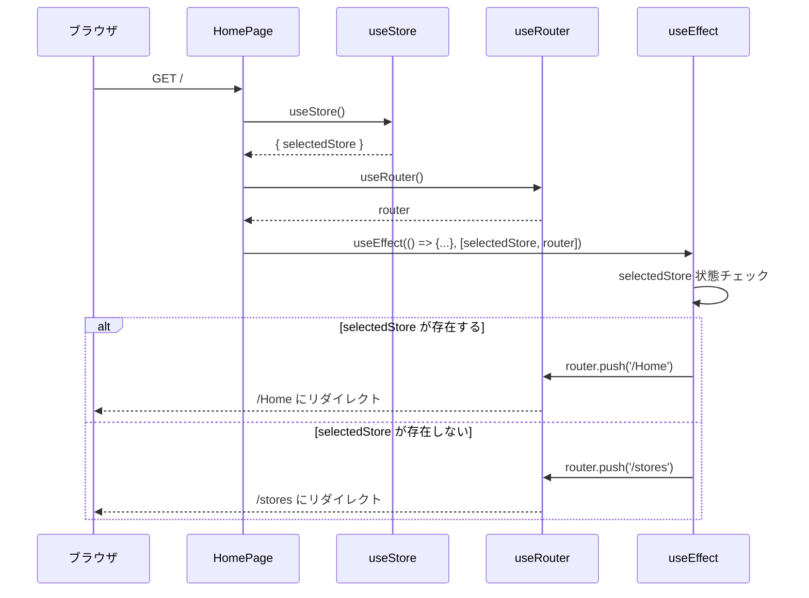
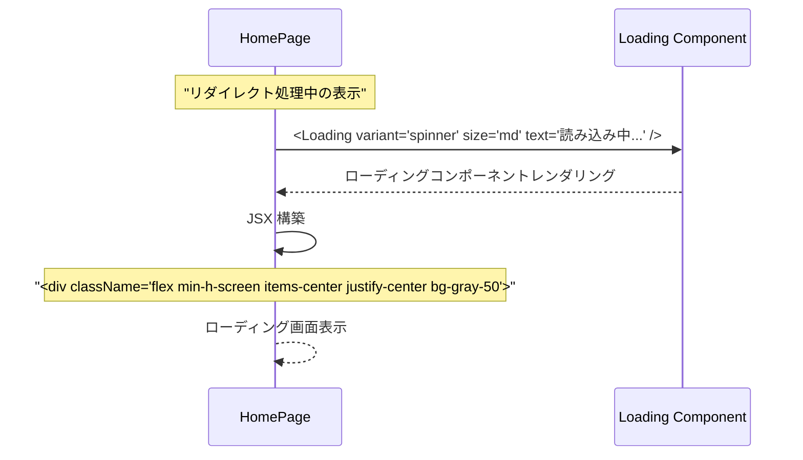
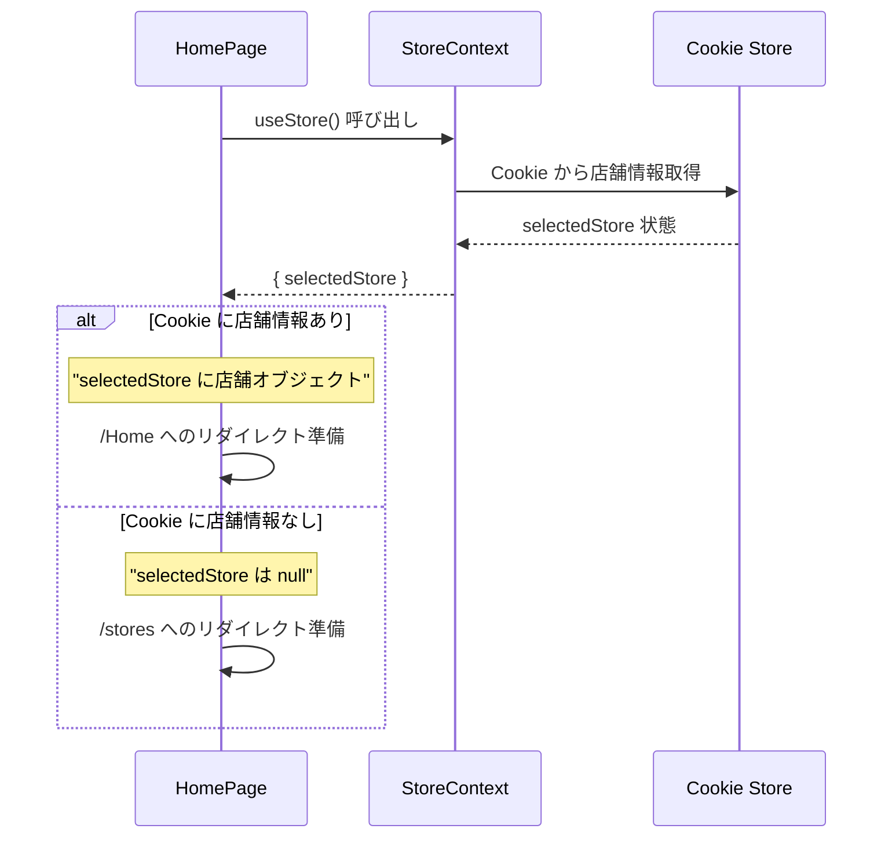
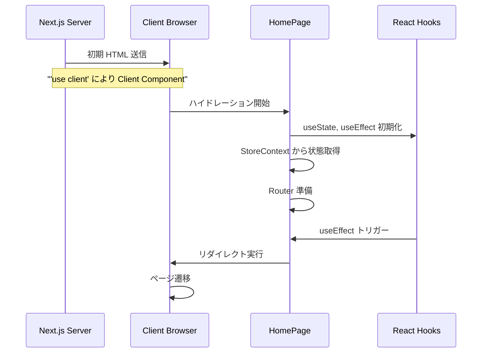
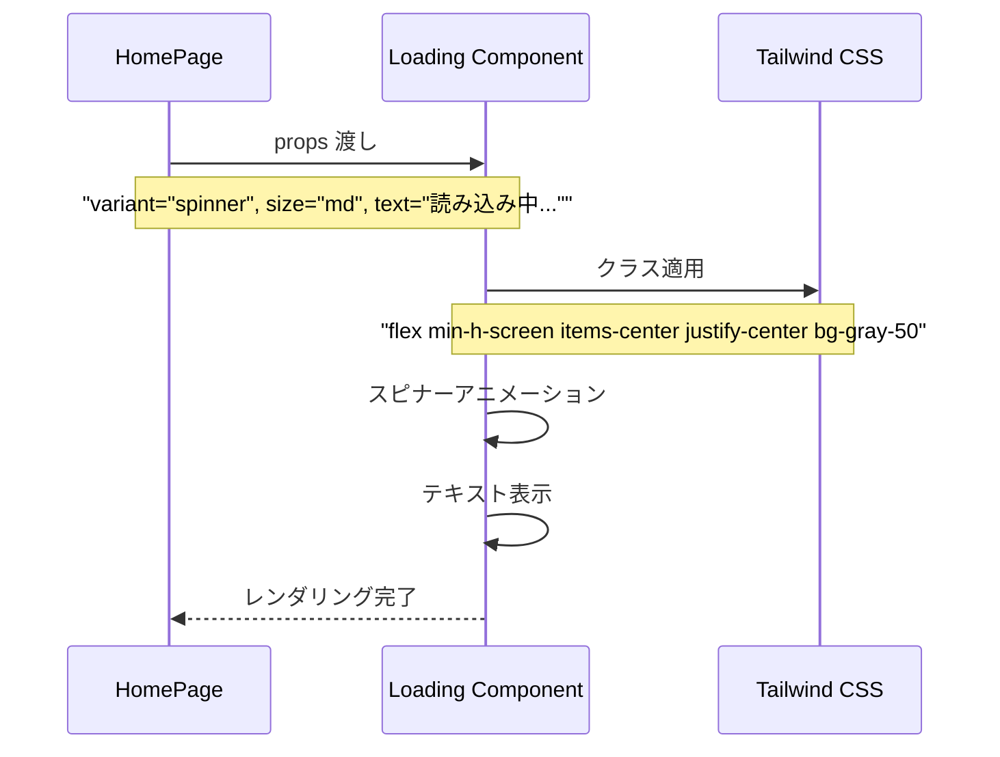

# page.tsx (Root) - シーケンス図

## 概要
ルートページ (Client Component) の処理フローを示すシーケンス図です。

## 1. ページ初期化とリダイレクト判定

## 2. レンダリング中の表示

## 3. 依存関係による再評価

useEffectの依存関係に基づく再評価プロセス：

### 評価フロー
1. **コンポーネントマウント** - 初期レンダリング時にuseEffectが実行される
2. **useEffect実行** - 依存配列 [selectedStore, router] の変更を監視
3. **selectedStore変更チェック** - 店舗選択状態の変更を確認
   - **変更あり** → リダイレクト判定処理へ進む
   - **変更なし** → router変更チェックへ進む
4. **router変更チェック** - Next.jsルーターの変更を確認
   - **変更あり** → リダイレクト判定処理へ進む
   - **変更なし** → 処理をスキップし現在の表示を維持

### リダイレクト判定
5. **selectedStore存在チェック** - 店舗が選択されているかを確認
   - **存在する** → `/Home`にリダイレクトしてメイン機能へ
   - **存在しない** → `/stores`にリダイレクトして店舗選択ページへ

この仕組みにより、店舗選択状態やルーターの変更に応じて適切なページへ自動リダイレクトが行われ、ユーザーは常に正しいページに導かれます。

## 4. StoreContext との連携

## 5. Client Component としての特性

## 6. ローディング表示の詳細

## リダイレクト判定ロジック

ルートページでのリダイレクト判定の詳細な流れ：

### 判定プロセス
1. **useEffect実行** - コンポーネントマウント時または依存関係変更時に実行
2. **selectedStoreチェック** - 現在の店舗選択状態を確認

### 店舗選択済みの場合
3. **ユーザーは店舗選択済み** - selectedStoreにオブジェクトが存在
4. **メイン機能にアクセス可能** - アプリケーションの主要機能を利用できる状態
5. **`router.push('/Home')`** - ホームページへのナビゲーション実行
6. **ホームページ表示** - メイン機能が利用可能なダッシュボード画面を表示

### 店舗未選択の場合
3. **ユーザーは店舗未選択** - selectedStoreがnullまたは未定義
4. **店舗選択が必要** - まず店舗を選択する必要がある状態
5. **`router.push('/stores')`** - 店舗選択ページへのナビゲーション実行
6. **店舗選択ページ表示** - 利用可能な店舗一覧から選択できる画面を表示

このロジックにより、ユーザーの状態に応じて最適なページへ自動的に誘導され、アプリケーションの使用準備が整います。

## 使用パターン

### 初回訪問時（店舗未選択）
1. ユーザーが `/` にアクセス
2. StoreContext で店舗状態確認
3. `selectedStore` が null
4. `/stores` にリダイレクト
5. 店舗選択ページ表示

### 再訪問時（店舗選択済み）
1. ユーザーが `/` にアクセス
2. Cookie から店舗情報復元
3. `selectedStore` に店舗オブジェクト
4. `/Home` にリダイレクト
5. メイン機能表示

### ローディング中の体験
1. リダイレクト判定処理中
2. Loading コンポーネント表示
3. スピナーアニメーション
4. "読み込み中..." メッセージ
5. リダイレクト完了で画面切り替え

## 特徴

### 1. 自動リダイレクト
- 店舗選択状態に応じた自動振り分け
- ユーザー体験の最適化

### 2. Client Component
- ブラウザでの状態管理
- リアルタイムなリダイレクト

### 3. ローディング表示
- リダイレクト中の視覚的フィードバック
- ユーザーの不安解消

### 4. 依存関係管理
- selectedStore と router の変更監視
- 適切なタイミングでの再評価

## パフォーマンス考慮

### リダイレクトの効率性
- useEffect による最適なタイミング
- 不要な再レンダリングの防止

### ローディング表示
- シンプルで軽量なコンポーネント
- CSS によるスムーズなアニメーション