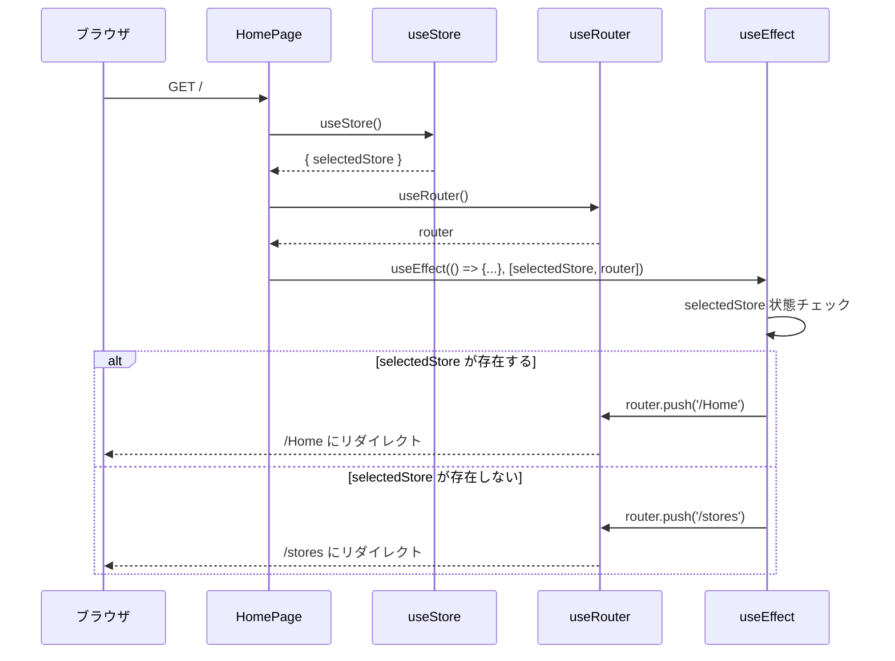
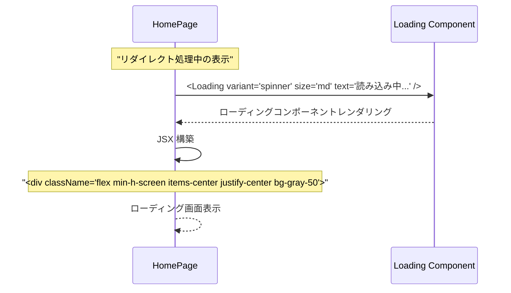
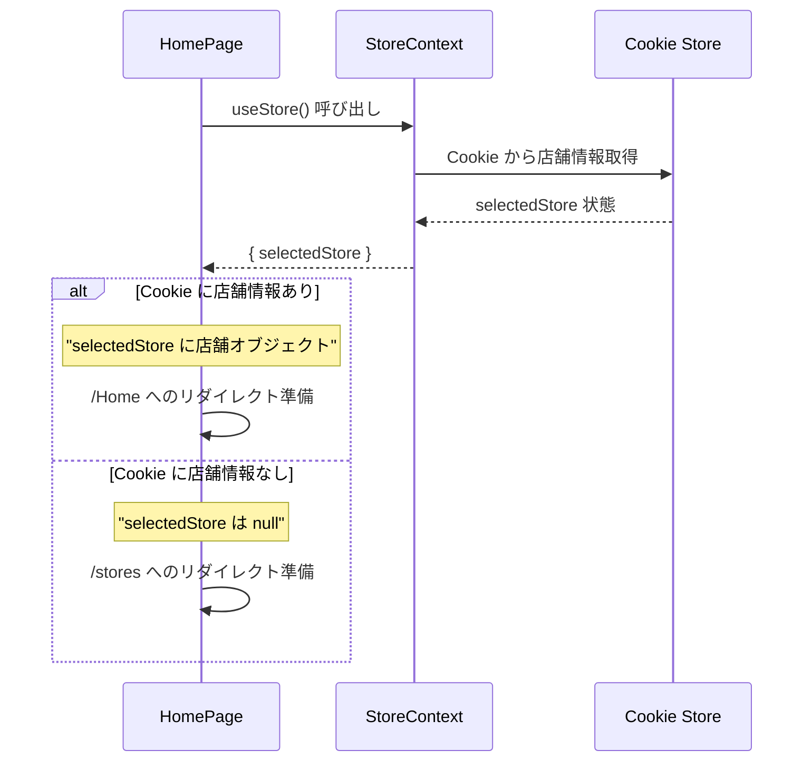
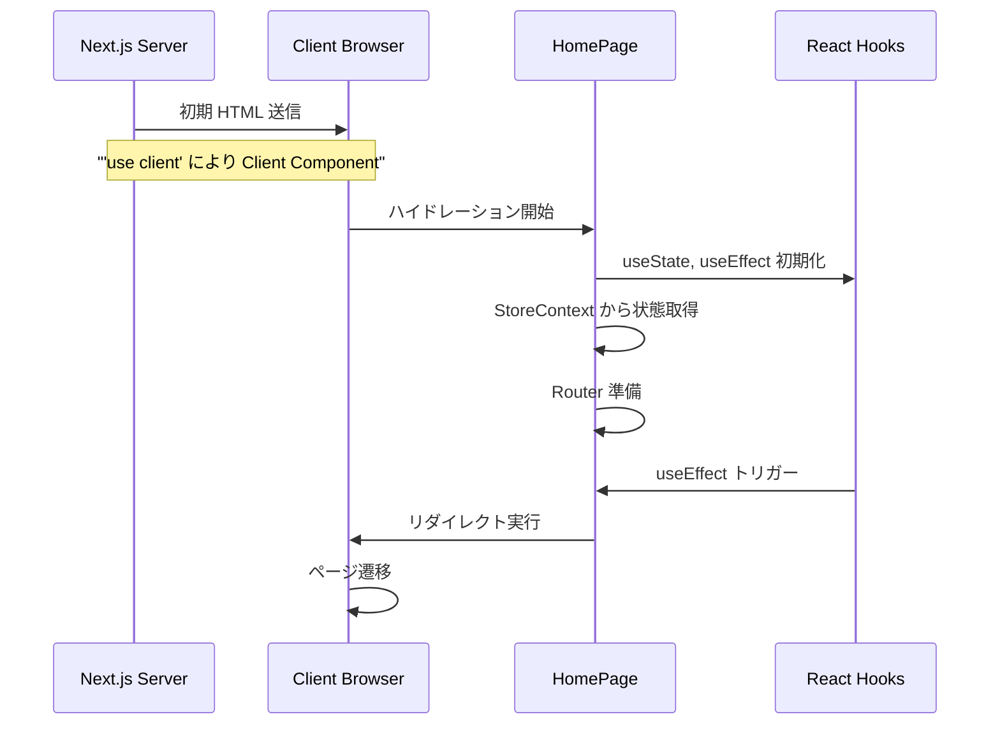
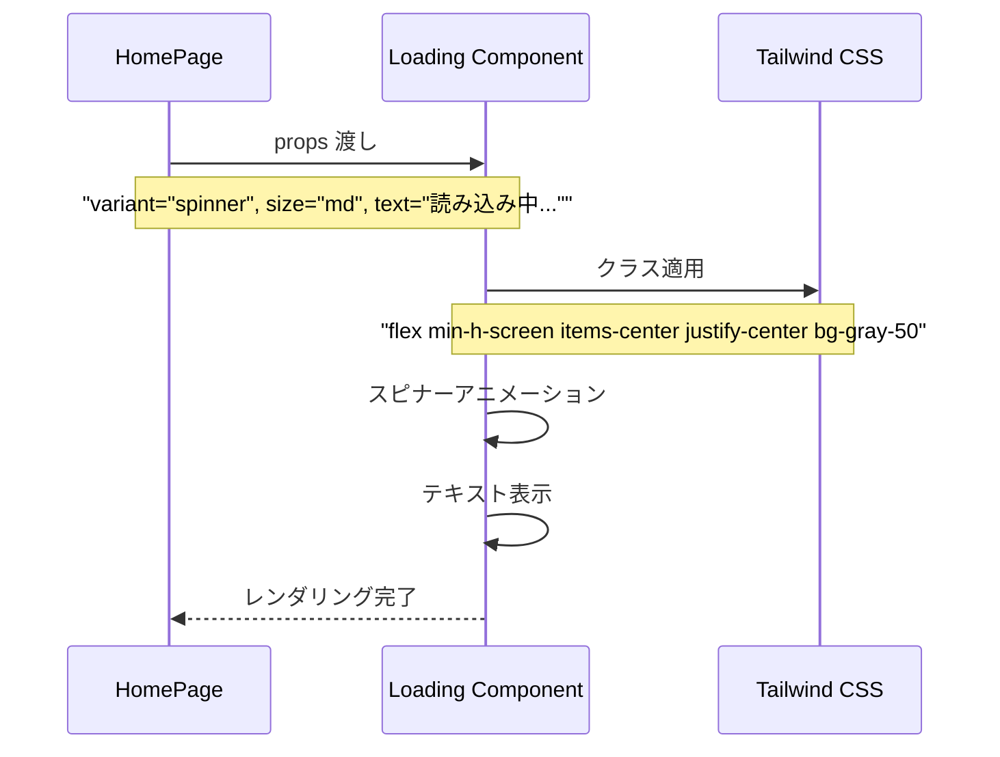

# page.tsx (Root) - シーケンス図

## 概要
ルートページ (Client Component) の処理フローを示すシーケンス図です。

## 1. ページ初期化とリダイレクト判定



## 2. レンダリング中の表示



## 3. 依存関係による再評価

```mermaid
flowchart TD
    A[コンポーネントマウント] --> B[useEffect 実行]
    B --> C{selectedStore 変更？}
    C -->|Yes| D[リダイレクト判定]
    C -->|No| E{router 変更？}
    E -->|Yes| D
    E -->|No| F[処理スキップ]
    
    D --> G{selectedStore 存在？}
    G -->|Yes| H[router.push('/Home')]
    G -->|No| I[router.push('/stores')]
    
    H --> J[/Home にリダイレクト]
    I --> K[/stores にリダイレクト]
    F --> L[現在の表示維持]
    
    style A fill:#e1f5fe
    style J fill:#c8e6c9
    style K fill:#c8e6c9
    style L fill:#fff3e0
```

## 4. StoreContext との連携



## 5. Client Component としての特性



## 6. ローディング表示の詳細



## リダイレクト判定ロジック

```mermaid
flowchart TD
    A[useEffect 実行] --> B{selectedStore をチェック}
    B -->|selectedStore が存在| C[ユーザーは店舗選択済み]
    B -->|selectedStore が null| D[ユーザーは店舗未選択]
    
    C --> E[メイン機能にアクセス可能]
    D --> F[店舗選択が必要]
    
    E --> G[router.push('/Home')]
    F --> H[router.push('/stores')]
    
    G --> I[ホームページ表示]
    H --> J[店舗選択ページ表示]
    
    style A fill:#e1f5fe
    style I fill:#c8e6c9
    style J fill:#c8e6c9
```

## 使用パターン

### 初回訪問時（店舗未選択）
1. ユーザーが `/` にアクセス
2. StoreContext で店舗状態確認
3. `selectedStore` が null
4. `/stores` にリダイレクト
5. 店舗選択ページ表示

### 再訪問時（店舗選択済み）
1. ユーザーが `/` にアクセス
2. Cookie から店舗情報復元
3. `selectedStore` に店舗オブジェクト
4. `/Home` にリダイレクト
5. メイン機能表示

### ローディング中の体験
1. リダイレクト判定処理中
2. Loading コンポーネント表示
3. スピナーアニメーション
4. "読み込み中..." メッセージ
5. リダイレクト完了で画面切り替え

## 特徴

### 1. 自動リダイレクト
- 店舗選択状態に応じた自動振り分け
- ユーザー体験の最適化

### 2. Client Component
- ブラウザでの状態管理
- リアルタイムなリダイレクト

### 3. ローディング表示
- リダイレクト中の視覚的フィードバック
- ユーザーの不安解消

### 4. 依存関係管理
- selectedStore と router の変更監視
- 適切なタイミングでの再評価

## パフォーマンス考慮

### リダイレクトの効率性
- useEffect による最適なタイミング
- 不要な再レンダリングの防止

### ローディング表示
- シンプルで軽量なコンポーネント
- CSS によるスムーズなアニメーション