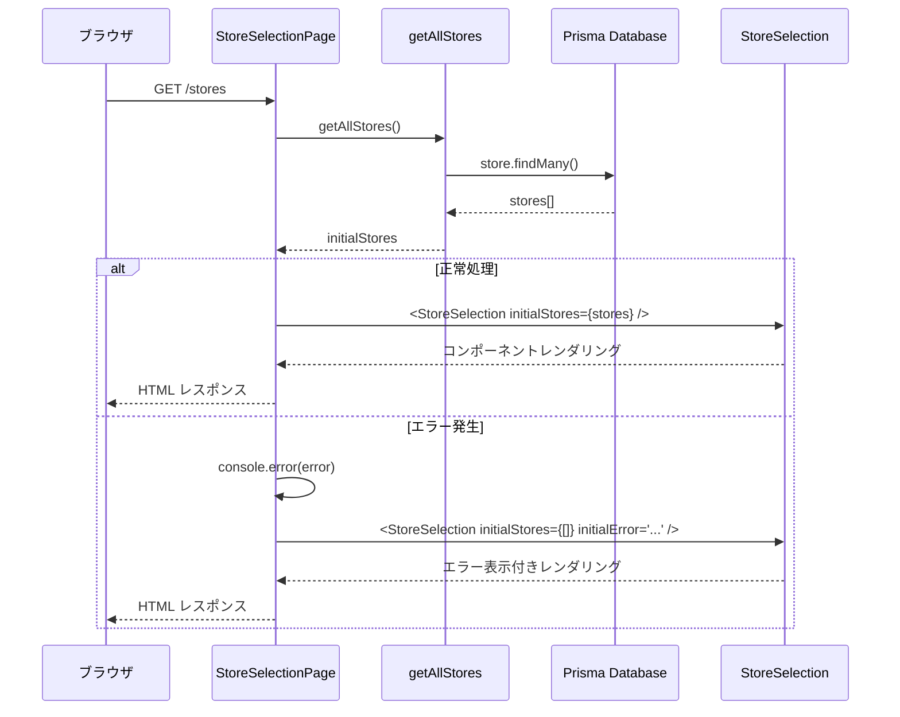
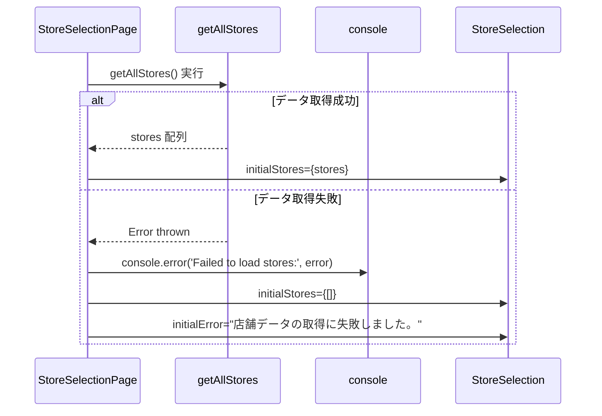
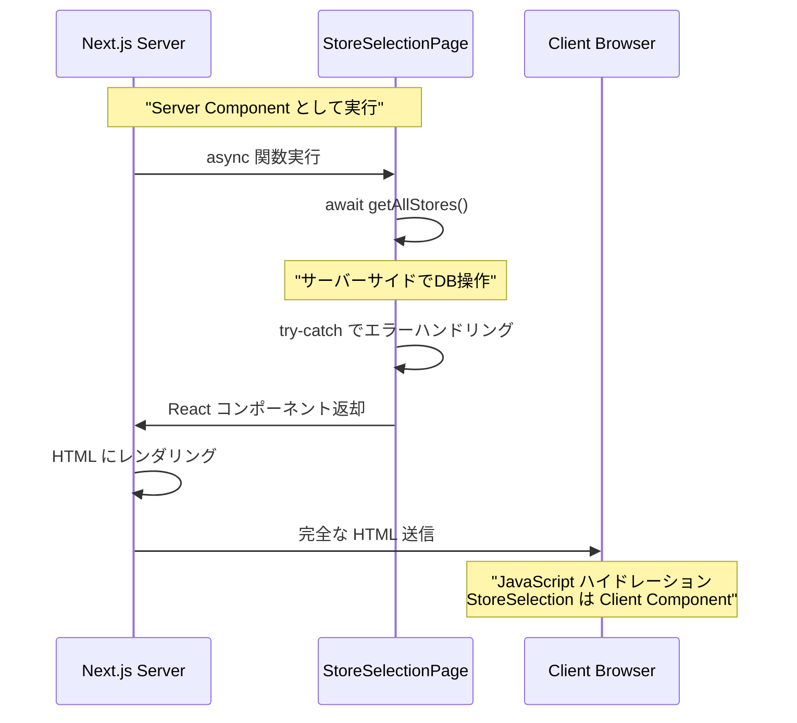
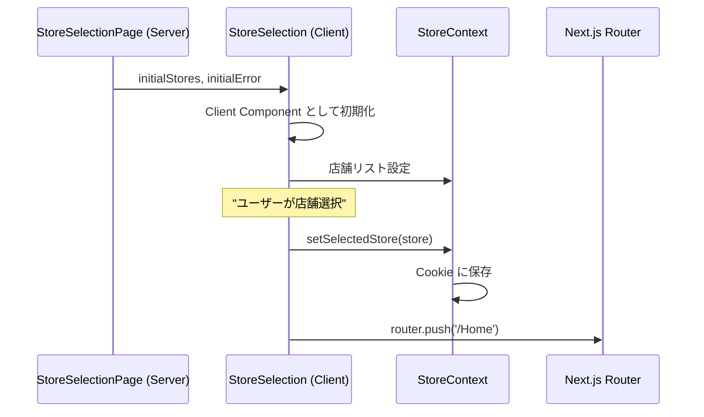

# stores/page.tsx - シーケンス図

## 概要
店舗選択ページ (Server Component) の処理フローを示すシーケンス図です。

## 1. ページレンダリング処理

## 2. エラーハンドリング詳細

## 3. メタデータ設定

メタデータの設定内容：

- **title**: '店舗選択 | 書店管理システム'
- **description**: 'ご利用する店舗を選択してください'

これらのメタデータはHTMLヘッドに反映され、SEO最適化に寄与します。

## 4. Server Component の特性

## 5. データフロー

Server Componentのデータフロー：

1. **/storesアクセス** → Server Component実行
2. **getAllStores()呼び出し** → データベースクエリ
3. **クエリ結果判定**：
   - 成功 → storesデータ取得 → StoreSelectionにprops渡し → 正常レンダリング
   - 失敗 → エラーキャッチ → エラーログ出力 → 空配列とエラーメッセージ渡し → エラー状態レンダリング
4. **HTMLレスポンス**生成

## 6. コンポーネント統合

## データ型とProps

### Store型
- `id: string` - 店舗ID
- `name: string` - 店舗名

### StoreSelectionPageProps型
- `initialStores: Store[]` - 初期店舗リスト
- `initialError?: string` - 初期エラーメッセージ

### Metadata型
- `title: string` - ページタイトル
- `description: string` - ページ説明

## 特徴

### 1. Server Component の利点
- サーバーサイドでのデータ取得
- クライアントへの JavaScript 送信量削減
- SEO 最適化

### 2. エラーハンドリング
- try-catch による安全なデータ取得
- エラー時のフォールバック表示
- ユーザーフレンドリーなエラーメッセージ

### 3. Props による初期化
- initialStores でデータ渡し
- initialError でエラー状態通知
- Client Component での状態管理

### 4. メタデータ管理
- Next.js 13+ の Metadata API 使用
- ページ固有のタイトルと説明

## 使用パターン

### 正常系フロー
1. ユーザーが `/stores` にアクセス
2. Server Component でデータ取得
3. StoreSelection コンポーネントに渡す
4. ユーザーが店舗選択
5. `/Home` へリダイレクト

### エラー系フロー
1. データ取得でエラー発生
2. エラーログ出力
3. 空の店舗リストとエラーメッセージ表示
4. ユーザーにエラー通知

## パフォーマンス考慮

### サーバーサイドレンダリング
- 初回表示の高速化
- データ取得の最適化
- クライアント負荷の軽減

### エラー時の処理
- 部分的な機能提供
- リトライ機能の提供（Client Component 側）