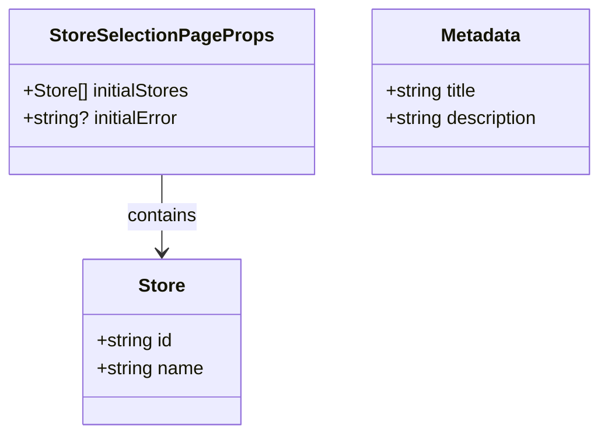

# stores/page.tsx - シーケンス図

## 概要
店舗選択ページ (Server Component) の処理フローを示すシーケンス図です。

## 1. ページレンダリング処理


## 2. エラーハンドリング詳細


## 3. メタデータ設定

```mermaid
flowchart TD
    A[ページアクセス] --> B[メタデータ export]
    B --> C[title: '店舗選択 | 書店管理システム']
    B --> D[description: 'ご利用する店舗を選択してください']
    C --> E[HTMLヘッドに反映]
    D --> E
    E --> F[SEO最適化]
    
    style A fill:#e1f5fe
    style F fill:#c8e6c9
```

## 4. Server Component の特性


## 5. データフロー

```mermaid
flowchart TD
    A[/stores アクセス] --> B{Server Component 実行}
    B --> C[getAllStores() 呼び出し]
    C --> D[データベースクエリ]
    D --> E{クエリ結果}
    E -->|成功| F[stores データ取得]
    E -->|失敗| G[エラーキャッチ]
    F --> H[StoreSelection に props 渡し]
    G --> I[エラーログ出力]
    I --> J[空配列とエラーメッセージ渡し]
    H --> K[正常レンダリング]
    J --> L[エラー状態レンダリング]
    K --> M[HTML レスポンス]
    L --> M
    
    style A fill:#e1f5fe
    style M fill:#c8e6c9
    style G fill:#ffcdd2
    style I fill:#ffcdd2
```

## 6. コンポーネント統合


## データ型とProps



## 特徴

### 1. Server Component の利点
- サーバーサイドでのデータ取得
- クライアントへの JavaScript 送信量削減
- SEO 最適化

### 2. エラーハンドリング
- try-catch による安全なデータ取得
- エラー時のフォールバック表示
- ユーザーフレンドリーなエラーメッセージ

### 3. Props による初期化
- initialStores でデータ渡し
- initialError でエラー状態通知
- Client Component での状態管理

### 4. メタデータ管理
- Next.js 13+ の Metadata API 使用
- ページ固有のタイトルと説明

## 使用パターン

### 正常系フロー
1. ユーザーが `/stores` にアクセス
2. Server Component でデータ取得
3. StoreSelection コンポーネントに渡す
4. ユーザーが店舗選択
5. `/Home` へリダイレクト

### エラー系フロー
1. データ取得でエラー発生
2. エラーログ出力
3. 空の店舗リストとエラーメッセージ表示
4. ユーザーにエラー通知

## パフォーマンス考慮

### サーバーサイドレンダリング
- 初回表示の高速化
- データ取得の最適化
- クライアント負荷の軽減

### エラー時の処理
- 部分的な機能提供
- リトライ機能の提供（Client Component 側）