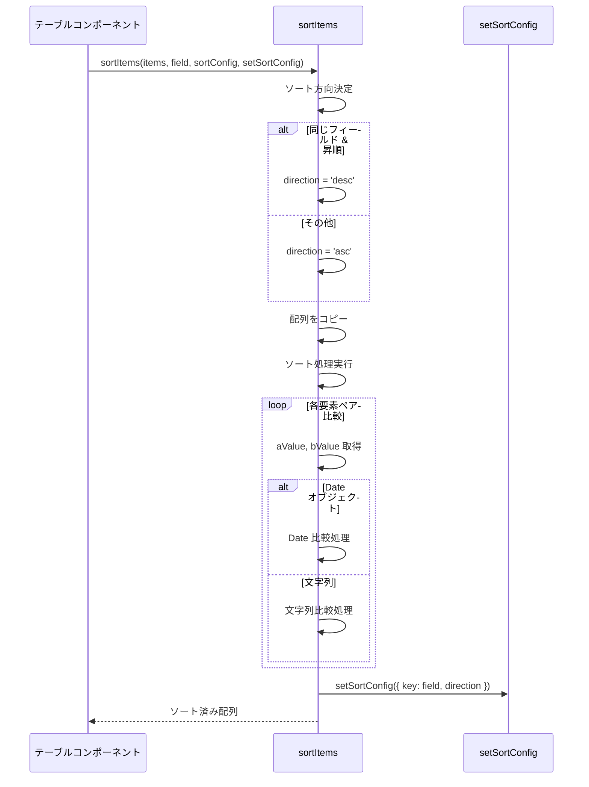
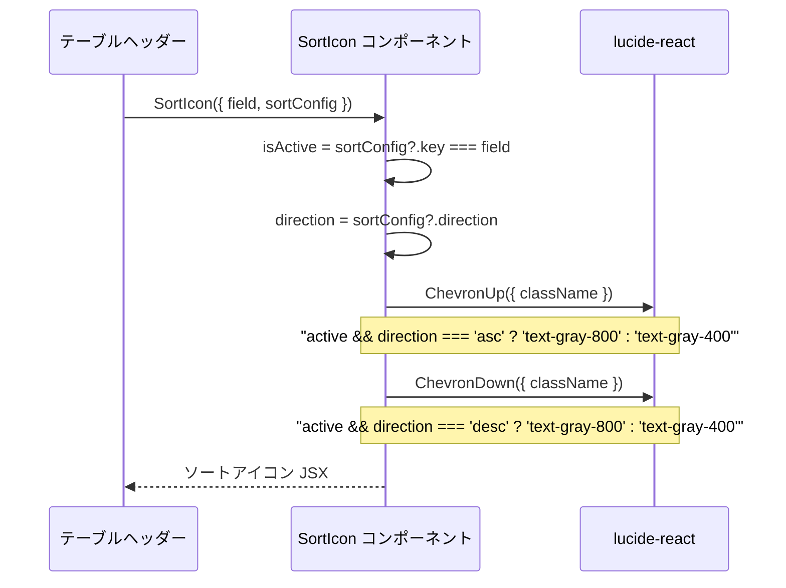
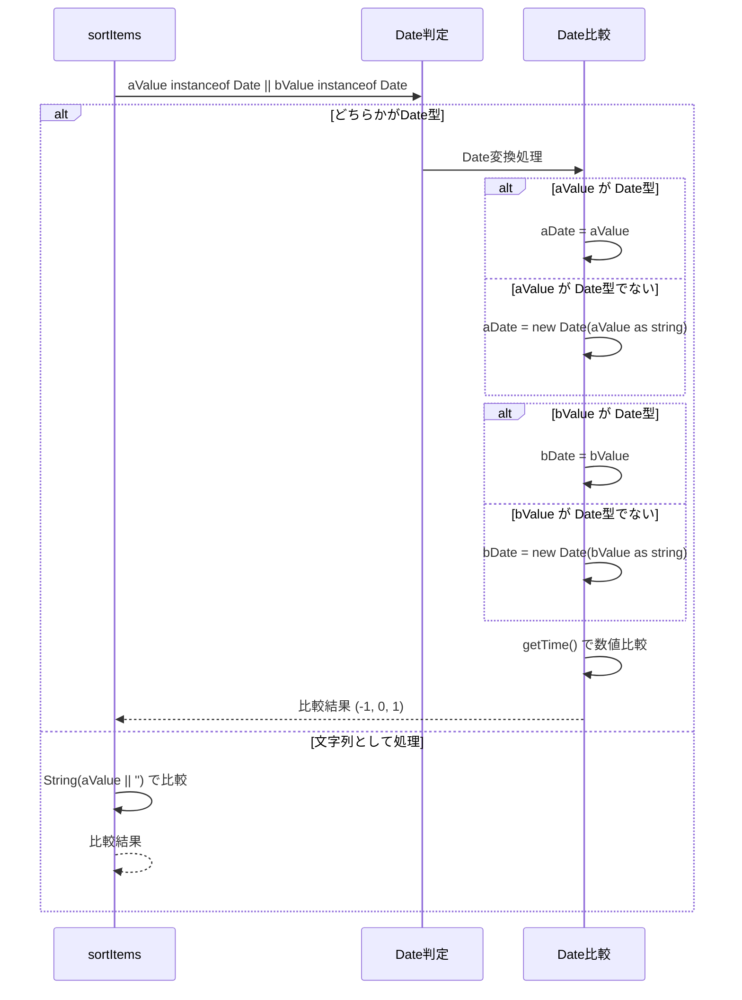
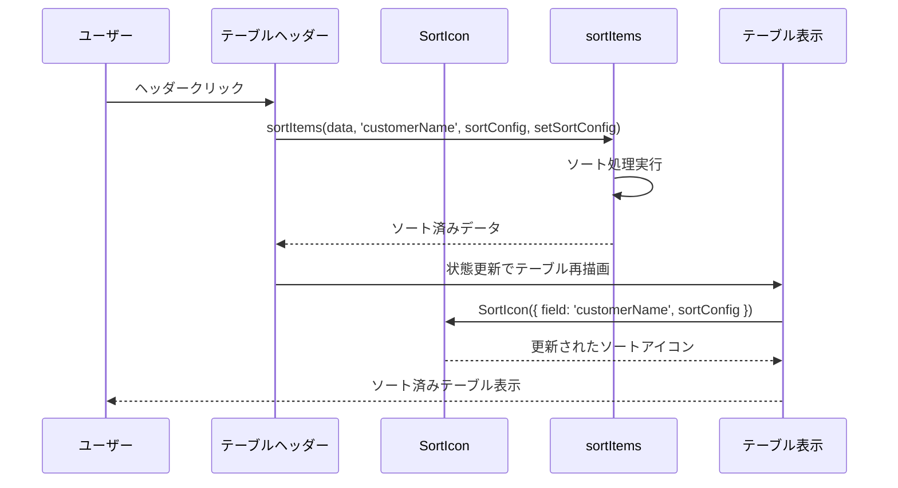

# sortUtils.tsx - シーケンス図

## 概要
汎用的なソート機能に関するユーティリティ関数とコンポーネントの処理フローを示すシーケンス図です。

## 1. ソート実行 (sortItems)



## 2. ソートアイコン表示 (SortIcon)



## 3. 日付ソートの詳細処理



## 4. ソート方向の決定ロジック

**sortItems ソート方向決定フロー**
1. sortItems 呼び出し → 現在のソート設定確認
2. ソート設定状態による方向決定：
   - sortConfig が null: direction = 'asc'
   - 異なるフィールド: direction = 'asc'
   - 同じフィールド & asc: direction = 'desc'
   - 同じフィールド & desc: direction = 'asc'
3. ソート実行：
   - 昇順 (direction = 'asc'): 昇順ソート実行
   - 降順 (direction = 'desc'): 降順ソート実行
4. ソート設定更新 → ソート済み配列返却

このロジックにより、直感的なソート操作が可能です。

## 5. 型安全なソート処理

**ソートユーティリティデータ構造**
- SortConfig<T>: key（keyof T）、direction フィールドでソート設定を管理
- SortIconProps<T>: field（keyof T）、sortConfig プロパティでソートアイコンを制御
- SortItemsFunction<T>: items、field、sortConfig、setSortConfig パラメータでソート機能を提供し、T[] を返却

SortIconProps と SortItemsFunction は SortConfig を参照し、型安全なソート機能を実現します。

## 6. コンポーネント統合使用例



## 使用例

### 基本的なテーブルソート
```typescript
const [sortConfig, setSortConfig] = useState<SortConfig<Customer> | null>(null);
const [customers, setCustomers] = useState<Customer[]>(initialData);

const handleSort = (field: keyof Customer) => {
  const sorted = sortItems(customers, field, sortConfig, setSortConfig);
  setCustomers(sorted);
};

// テーブルヘッダー
<th onClick={() => handleSort('name')}>
  顧客名
  <SortIcon field="name" sortConfig={sortConfig} />
</th>
```

### 日付フィールドのソート
```typescript
// Date型、文字列型の両方に対応
const handleDateSort = () => {
  const sorted = sortItems(orders, 'orderDate', sortConfig, setSortConfig);
  setOrders(sorted);
};
```

## 特徴

### 1. 型安全性
- ジェネリクスによる型推論
- フィールド名のタイプセーフティ

### 2. 柔軟性
- Date型と文字列型の自動判別
- カスタム比較ロジック

### 3. UI統合
- ソートアイコンコンポーネント
- 視覚的なフィードバック

### 4. 状態管理
- React state との統合
- ソート設定の永続化

### 5. パフォーマンス
- 元配列の変更を避ける（コピー作成）
- 効率的な比較処理