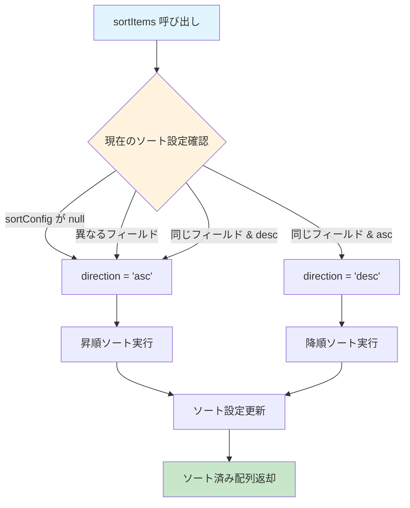
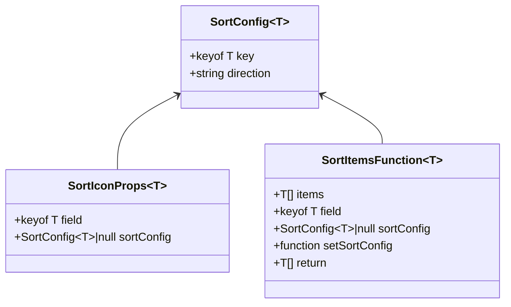

# sortUtils.tsx - シーケンス図

## 概要
汎用的なソート機能に関するユーティリティ関数とコンポーネントの処理フローを示すシーケンス図です。

## 1. ソート実行 (sortItems)


## 2. ソートアイコン表示 (SortIcon)


## 3. 日付ソートの詳細処理


## 4. ソート方向の決定ロジック



## 5. 型安全なソート処理



## 6. コンポーネント統合使用例


## 使用例

### 基本的なテーブルソート
```typescript
const [sortConfig, setSortConfig] = useState<SortConfig<Customer> | null>(null);
const [customers, setCustomers] = useState<Customer[]>(initialData);

const handleSort = (field: keyof Customer) => {
  const sorted = sortItems(customers, field, sortConfig, setSortConfig);
  setCustomers(sorted);
};

// テーブルヘッダー
<th onClick={() => handleSort('name')}>
  顧客名
  <SortIcon field="name" sortConfig={sortConfig} />
</th>
```

### 日付フィールドのソート
```typescript
// Date型、文字列型の両方に対応
const handleDateSort = () => {
  const sorted = sortItems(orders, 'orderDate', sortConfig, setSortConfig);
  setOrders(sorted);
};
```

## 特徴

### 1. 型安全性
- ジェネリクスによる型推論
- フィールド名のタイプセーフティ

### 2. 柔軟性
- Date型と文字列型の自動判別
- カスタム比較ロジック

### 3. UI統合
- ソートアイコンコンポーネント
- 視覚的なフィードバック

### 4. 状態管理
- React state との統合
- ソート設定の永続化

### 5. パフォーマンス
- 元配列の変更を避ける（コピー作成）
- 効率的な比較処理