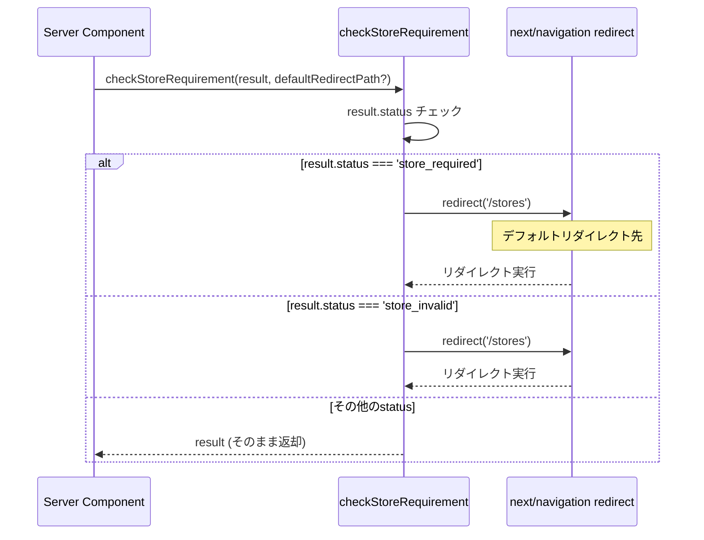
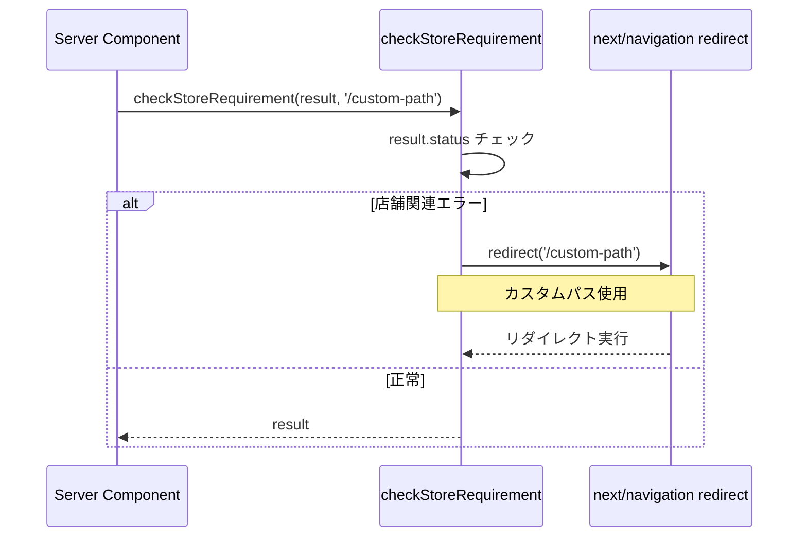
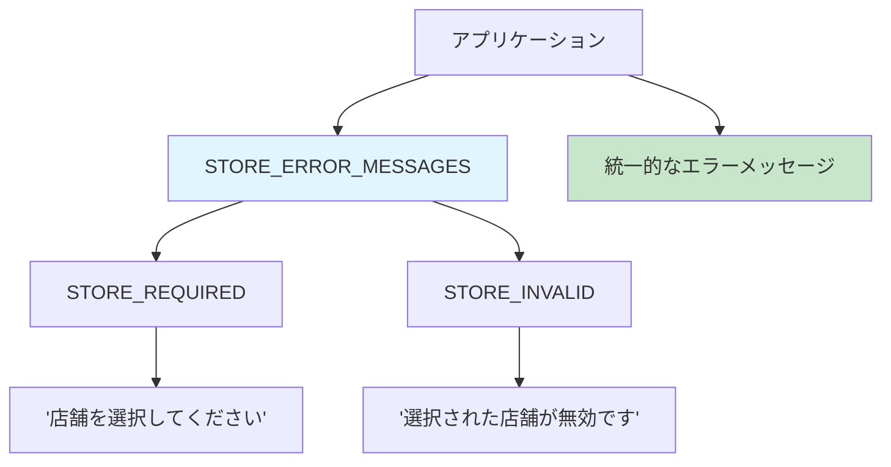
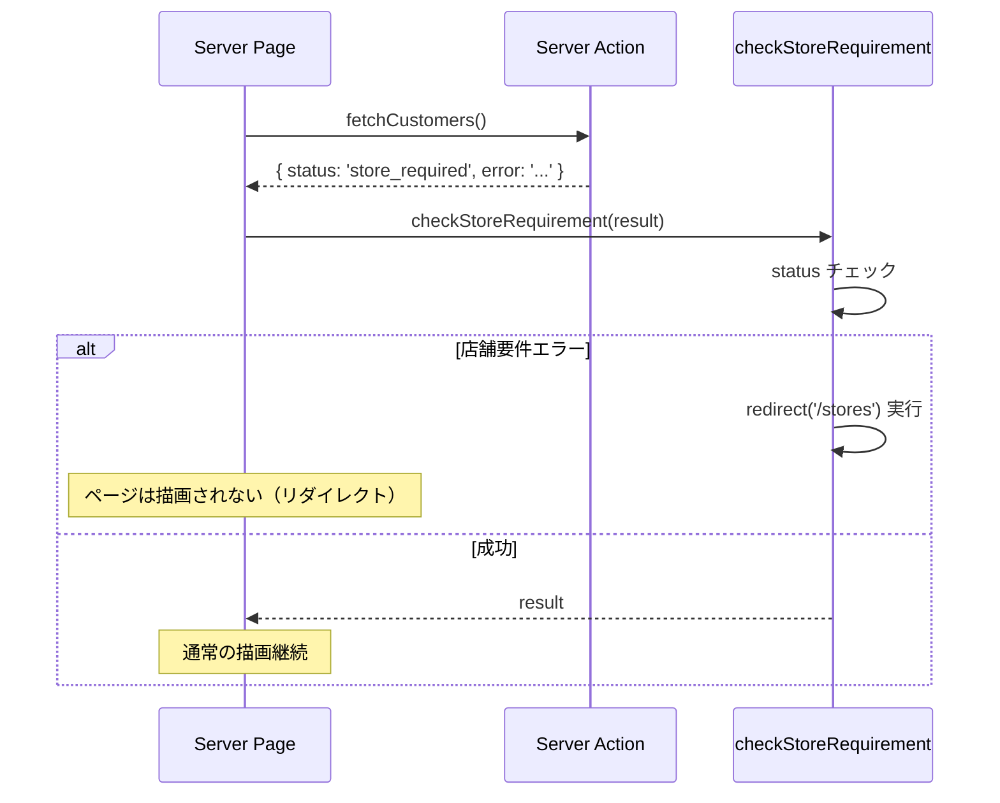
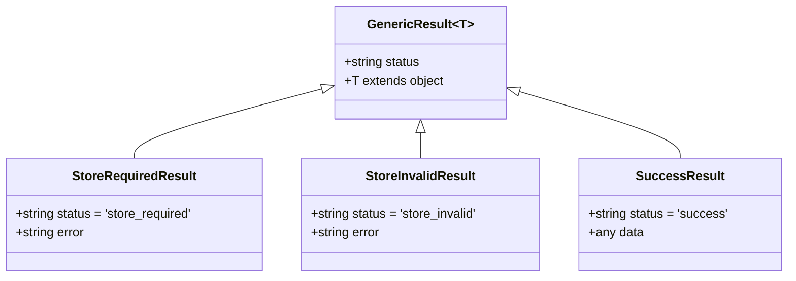
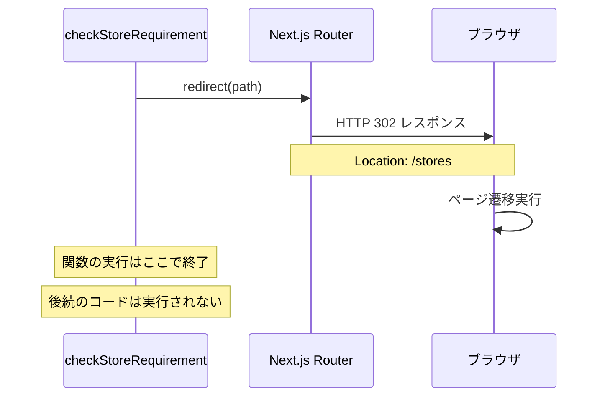

# storeRedirect.ts - シーケンス図

## 概要
Server Actionの結果チェックとリダイレクトに関するユーティリティ関数の処理フローを示すシーケンス図です。

## 1. 店舗要件チェック (checkStoreRequirement)



## 2. カスタムリダイレクト先指定



## 3. エラーメッセージ定数の使用



## 4. 関数の使用パターン



## 5. 型安全性の確保



## 6. リダイレクト処理の詳細



## 使用例

### 基本的な使用方法
```typescript
// Server Component内で
const result = await fetchCustomers();
checkStoreRequirement(result); // 必要に応じてリダイレクト

// 結果を使用（リダイレクトされなかった場合のみ実行される）
return <CustomerList customers={result.data} />;
```

### カスタムリダイレクト先
```typescript
// 特定のページにリダイレクトしたい場合
const result = await fetchOrders();
checkStoreRequirement(result, '/dashboard');
```

### エラーメッセージの統一
```typescript
import { STORE_ERROR_MESSAGES } from '@/app/utils/storeRedirect';

// 一貫したエラーメッセージ
const errorMessage = STORE_ERROR_MESSAGES.STORE_REQUIRED;
```

## 利点

### 1. コードの簡素化
- Server Componentでの定型的なチェック処理を削減
- if文の繰り返しを防止

### 2. 一貫性の確保
- 全てのページで同じリダイレクト動作
- エラーメッセージの統一

### 3. 型安全性
- ジェネリクスによる型の保持
- TypeScriptでの型チェック

### 4. 保守性
- リダイレクト先の一元管理
- エラーメッセージの一元管理