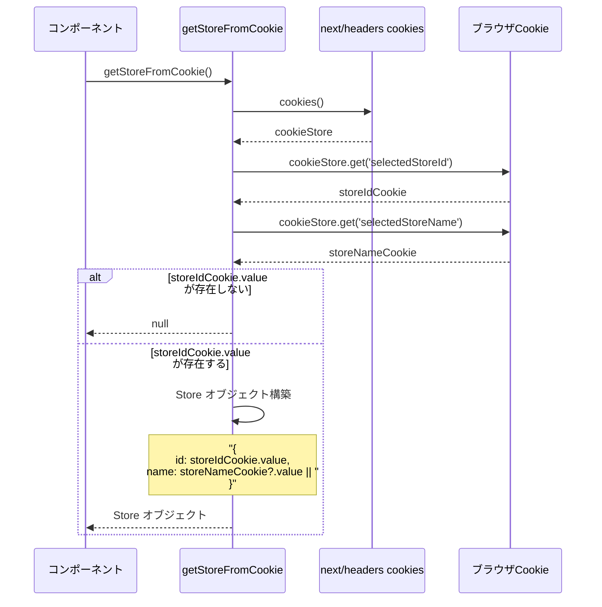
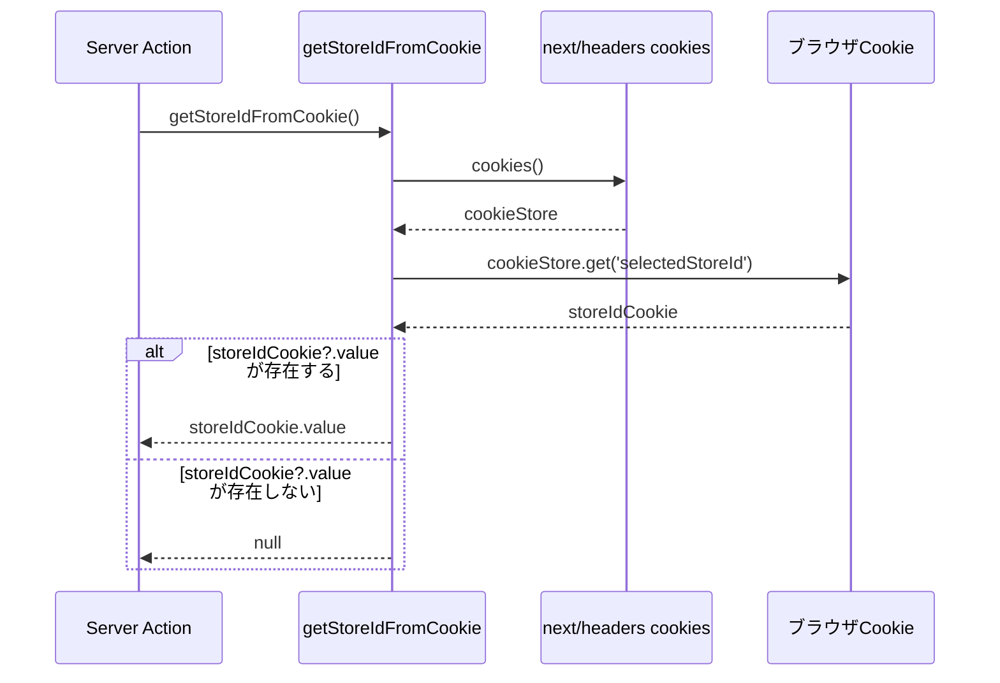
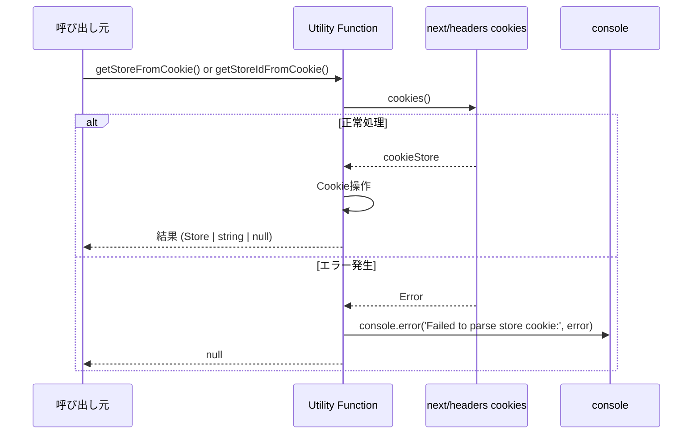
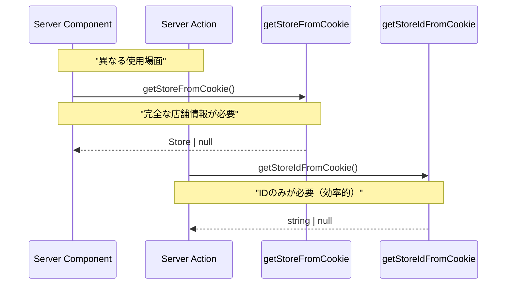

# storeUtils.ts - シーケンス図

## 概要
店舗情報のCookie操作に関するユーティリティ関数の処理フローを示すシーケンス図です。

## 1. 店舗情報取得 (getStoreFromCookie)

## 2. 店舗ID取得 (getStoreIdFromCookie)

## 3. エラーハンドリング

## 4. Cookie構造とデータ復元

**Cookie からの Store データ復元フロー**
1. Cookie から値取得 → selectedStoreId 存在チェック
2. selectedStoreId 状態による分岐：
   - 存在しない: null を返却
   - 存在する: selectedStoreName 取得
3. storeName 状態による Store オブジェクト作成：
   - storeName 存在: Store オブジェクト作成
   - storeName なし: Store オブジェクト作成 (name: '')
4. 結果返却

このフローにより、Cookie から安全に Store データを復元できます。

## 5. 使用パターン比較

## データ型定義

**Store ユーティリティデータ構造**
- Store: id、name フィールドを持つ店舗データ
- CookieStructure: selectedStoreId、selectedStoreName フィールドで Cookie に保存されるデータ構造

CookieStructure は Store に復元され、一貫した店舗管理を実現します。

## 関数の特徴

### getStoreFromCookie
- **用途**: Server Componentでの初期化時
- **戻り値**: `Store | null`
- **処理**: IDと名前の両方を取得してオブジェクト化
- **フォールバック**: 名前が無い場合は空文字

### getStoreIdFromCookie  
- **用途**: Server Actionでの権限チェック
- **戻り値**: `string | null`
- **処理**: IDのみを効率的に取得
- **パフォーマンス**: 軽量で高速

## エラー処理戦略

### 失敗時の動作
1. Cookie読み取りエラー → `null` 返却
2. パースエラー → `null` 返却  
3. 値が存在しない → `null` 返却

### ログ出力
- エラー詳細をコンソールに出力
- アプリケーションの動作は継続

## セキュリティ考慮

### Cookie値の検証
- 存在チェックのみ実施
- 値の内容検証は呼び出し側で実施

### エラー情報
- 詳細なエラーはサーバーログのみ
- クライアントには `null` のみ返却