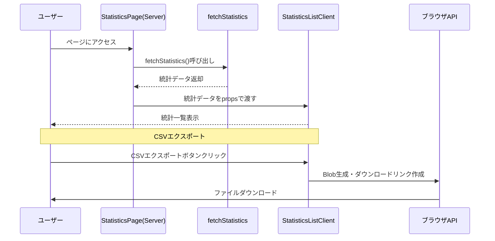

```mermaid
    sequenceDiagram
    participant User as ユーザー
    participant Page as StatisticsPage(Server)
    participant Actions as fetchStatistics
    participant Client as StatisticsListClient
    participant Browser as ブラウザAPI

    User->>Page: ページにアクセス
    Page->>Actions: fetchStatistics()呼び出し
    Actions-->>Page: 統計データ返却
    Page->>Client: 統計データをpropsで渡す
    Client-->>User: 統計一覧表示

    Note over User,Client: CSVエクスポート
    User->>Client: CSVエクスポートボタンクリック
    Client->>Browser: Blob生成・ダウンロードリンク作成
    Browser->>User: ファイルダウンロード
```
